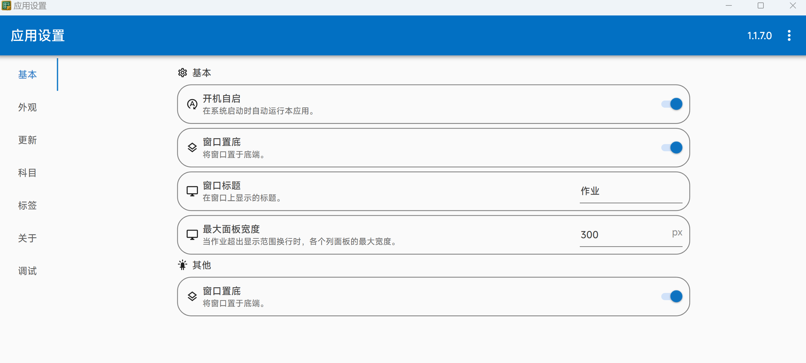

# Awesome Class Softwares
# 适用于班级一体机的优质软件列表

[-blue
?style=flat&logo=Github&label=Creat%20at)](https://github.com/Jursin/Awesome-Class-Softwares)

> **🌐网站**
>
> [**点击跳转**](https://jursin.github.io/Awesome-Class-Softwares-Web/)

> [!important]
> **本文档旨在推荐以下优质软件，尽可能详细展现其功能，如欲提出问题，请前往对应仓库/交流平台**🔗
>
> **本文档仅供参考，信息可能会更新不及时，请前往对应仓库查看最新动态**
>
> **若发现任何错误/过时/遗漏信息，或希望推荐新软件，欢迎提交 [`Issues`](https://github.com/Jursin/Awesome-Class-Softwares/issues) 使我知晓或 [`Pull Requests`](https://github.com/Jursin/Awesome-Class-Softwares/pulls) 等待合并。**

> [!warning]
> **以下软件均为免费，如遇收费提示请注意甄别！**
>
> **🚫严禁上传违法敏感内容，⚠️请在遵守中华人民共和国相关法律规定和您所在地区的地方法律法规的情况下上传合法内容**

> [!tip]
> **你知道吗？**
> 
> **以下项目开发者基本都是学生**🤓
> 
> **以下徽章大部分点击后可跳转到对应链接**🔗

> **👋同类项目**

## 📃目录

### 🗓️[课表类](#🗓️课表类)

| 软件 | 组织/主开发者 |
| - | - |
|  [ClassIsland](#classisland) |   [`ClassIsland`](https://github.com/ClassIsland)  [`HelloWRC`](https://github.com/HelloWRC) |
| [Class-Widgets](#class-widgets) |  [`Class-Widgets`](https://github.com/Class-Widgets)  [`RinLit-233-shiroko`](https://github.com/RinLit-233-shiroko) |
|  [ElectronClassSchedule](#electronclassschedule) |  [`EnderWolf006`](https://github.com/EnderWolf006) |
|  [iClass](#iclass) |  [`gpuawa`](https://github.com/gpuawa) |

### 🧩[多功能类](#🧩多功能类)

| 软件 | 组织/主开发者 |
| - | - |
|  [Ris_ClassTool](#ris_classtool) |  [`Ris-Soft`](https://github.com/Ris-Soft)  [`PYLXU`](https://github.com/PYLXU)|
|  [ZongziTEK黑板贴](#zongzitek黑板贴) |  [`STBBRD`](https://github.com/STBBRD) |

### 📊[看板类](#📊看板类)

| 软件 | 组织/主开发者 |
| - | - |
|  [ExamAware](#examaware) |  [`ExamAware`](https://github.com/ExamAware)  [`Hello8693`](https://github.com/Hello8693) |
|  [Sticky-attention](#sticky-attention) |  [`Sticky-attention`](https://github.com/Sticky-attention)  [`jizilin6732`](https://github.com/jizilin6732) |
|  [HomeworkBoard](#homeworkboard) |  [`EnderWolf006`](https://github.com/EnderWolf006) |
|  [Classworks](#classworks) |  [`ClassworksDev`](https://github.com/ClassworksDev)  [`SunWuyuan`](https://github.com/SunWuyuan) |

### 🖍️[批注类](#🖍️批注类)

| 软件 | 组织/主开发者 |
| - | - |
|  [Ink-Canvas](#ink-canvas) |  [`WXRIW`](https://github.com/WXRIW) |
|  [Ink-Canvas-Plus](#ink-canvas-plus) |  [`clover-yan`](https://github.com/clover-yan/) |
|  [Ink-Canvas-Artistry](#ink-canvas-artistry) |  [`InkCanvas`](https://github.com/InkCanvas)  [`ChangSakura`](https://github.com/ChangSakura) |
|  [InkCanvasForClass](#inkcanvasforclass) |  [`InkCanvas`](https://github.com/InkCanvas) |
|  [ICC-CE](#icc-ce) |  [`CJKmkp`](https://github.com/CJKmkp) |
|  [SketchNow](#sketchnow) |  [`SketchNow`](https://github.com/SketchNow)  [`realybin`](https://github.com/realybin) |
|  [智绘教Inkeys](#智绘教inkeys) |  [`Alan-CRL`](https://github.com/Alan-CRL) |
|  [Inkways-Classic](#inkways-classic) |  [`iNKORE Studios`](https://github.com/iNKORE-NET) |
|  [LemonxNote](#lemonxnote) |  [`lh11117`](https://github.com/lh11117) |

### ⬇️[下载/启动器](#⬇️下载/启动器)

| 软件 | 组织/主开发者 |
| - | - |
|  [SectionIstool](#SectionIstool) |  [`SectionIstool`](https://github.com/SectionIstool)  [`lzy98276`](https://github.com/lzy98276) |
|  [SeewoHUB](#seewohub) |  [`CNwenwen`](https://github.com/CNwenwen) |

### 🎲[杂项](#🎲杂项)

| 软件 | 组织/主开发者 |
| - | - |
|  [NamePicker](#namepicker) |  [`NamePicker`](https://github.com/NamePickerOrg)  [`LHGS-github`](https://github.com/LHGS-github) |
|  [Rand](#rand) |  [`LuoYunXi0407`](https://github.com/LuoYunXi0407) |

## 🗓️课表类

<image src="https://github.com/ClassIsland/ClassIsland/blob/master/ClassIsland/Assets/AppLogo_AppLogo.svg" height="64">

### ClassIsland

一款适用于班级一体机的课程信息显示软件，支持显示当日课表、课程信息与各`组件`信息，具有丰富的`插件系统`，支持各种精细化设置。

本项目名称的灵感源于`iOS 灵动岛（Dynamic Island）`

本项目受到[`DuguSand/class_form`](https://github.com/DuguSand/class_form)的启发而开发。

<image src="https://github.com/ClassIsland/ClassIsland/blob/master/ClassIsland/Assets/AppLogo_AppLogo.svg" height="16"/>[ClassIsland 官网](https://classisland.tech/)｜[ClassIsland 文档](https://docs.classisland.tech)｜[ClassIsland 投票](https://github.com/ClassIsland/voting/discussions)

GitHub仓库：[https://github.com/ClassIsland/ClassIsland](https://github.com/ClassIsland/ClassIsland)

`.NET 6`兼容版仓库：[https://github.com/ClassIsland/ClassIsland-net6](https://github.com/ClassIsland/ClassIsland-net6)（可在`Windows 7`上正常运行）

#### 功能
- [主界面](https://docs.classisland.tech/app/basic.html#%E4%B8%BB%E7%95%8C%E9%9D%A2)
  - 显示各[组件](https://docs.classisland.tech/app/basic.html#%E7%BB%84%E4%BB%B6)信息，如当天课表、课程信息
  - 自定义课表隐藏规则集、临时隐藏与鼠标穿透
- [提醒](https://docs.classisland.tech/app/notifications.html)
  - 支持[`上下课提醒`、`放学提醒`、`天气/预警提醒`](https://docs.classisland.tech/app/notifications.html#%E6%8F%90%E9%86%92%E8%AE%BE%E7%BD%AE)，可设置提醒优先级，提醒横幅可自选搭配[`提醒音效`、`强调特效`和`提醒语音`](https://docs.classisland.tech/app/notifications.html#%E5%BC%BA%E8%B0%83%E6%8F%90%E9%86%92)
- [档案编辑](https://docs.classisland.tech/app/profile/)
  - [科目](https://docs.classisland.tech/app/profile/subject.html)
  - [时间表](https://docs.classisland.tech/app/profile/time-layout.html)
  - [课表](https://docs.classisland.tech/app/profile/classplan.html)
    - 应在编辑好`科目`与`时间表`之后
    - 支持[`临时课表与临时层`](https://docs.classisland.tech/app/profile/classplan.html#%E4%B8%B4%E6%97%B6%E8%AF%BE%E8%A1%A8%E4%B8%8E%E4%B8%B4%E6%97%B6%E5%B1%82)、[`课表群`](https://docs.classisland.tech/app/profile/classplan.html#%E8%AF%BE%E8%A1%A8%E7%BE%A4)
  - [附加设置](https://docs.classisland.tech/app/profile/attached-settings.html)
  - [从表格导入](https://docs.classisland.tech/app/profile/#%E4%BB%8E%E8%A1%A8%E6%A0%BC%E5%AF%BC%E5%85%A5)
  - [从其他软件导入](https://docs.classisland.tech/app/migrate/)
  - 多周轮换，[临时换课](https://docs.classisland.tech/app/profile/classplan.html#%E6%8D%A2%E8%AF%BE)
- [组件](https://docs.classisland.tech/app/basic.html#%E7%BB%84%E4%BB%B6)
  - 日期、时间、课程表、天气简报、倒数日、自定义文本、轮播组件、分组组件
- [插件](https://github.com/ClassIsland/PluginIndex)
- [集控管理](https://docs.classisland.tech/management/)
  - [集控仓库](https://github.com/ClassIsland/ManagementServer)***（🚧开发中，即将发布）***
- [获取调试信息](https://docs.classisland.tech/app/faq/reporting-issue.html)
- [回声洞](https://docs.qq.com/sheet/DS3pQdk5IRmZnbmhu)、[投票](https://github.com/ClassIsland/voting)
- 现代化界面风格与丝滑、灵动的过渡动画
- 自动获取主题色
- 软件自动更新

<image src="https://github.com/Class-Widgets/Class-Widgets/blob/main/img%2FLogo.png" height="64">

### Class-Widgets

 

一款全新课表软件

[Releases](https://github.com/Class-Widgets/Class-Widgets/releases)｜[使用文档](https://www.yuque.com/rinlit/class-widgets_help)

GitHub仓库：[https://github.com/Class-Widgets/Class-Widgets](https://github.com/Class-Widgets/Class-Widgets) 

#### 功能
- 以小组件形式显示：
	- 当前活动结束剩余时间、当前活动、接下来课程
	- 天气、倒数日
- 方便的提醒系统：
	- [上下课提醒](https://www.yuque.com/rinlit/class-widgets_help/fv2ou1i1ngap0hrl)和预备铃
- 简洁直观的[课程表编辑界面](https://www.yuque.com/rinlit/class-widgets_help/oozelh8r56tmw0xb)
- [快捷调休/换课](https://www.yuque.com/rinlit/class-widgets_help/gc4epffu7g5bf9os)
- 同时存储多套课表，支持文件导入/导出
- [个性化](https://www.yuque.com/rinlit/class-widgets_help/qyly70ht1ogge1pi)主题设置，支持浅色/深色模式

<image src="https://github.com/EnderWolf006/ElectronClassSchedule/blob/main/image%2Ficon.png" height="64">

### ElectronClassSchedule

 

一款电子课程表软件

[使用说明](https://github.com/EnderWolf006/ElectronClassSchedule?tab=readme-ov-file#%E9%A3%9F%E7%94%A8%E8%AF%B4%E6%98%8E)

GitHub仓库：[https://github.com/EnderWolf006/ElectronClassSchedule](https://github.com/EnderWolf006/ElectronClassSchedule)

#### 功能
- 显示当天课程表、星期，倒数日
- 下课/上课倒计时
- 支持动态调整课表，支持多周(最多四周)课表轮换
- 窗口置顶，可点击穿透
- 编辑配置文件以编辑时间/课表

### iClass

## 🧩多功能类

<image src="https://github.com/Ris-Soft/Ris_ClassTool/blob/master/Main%2Flogo.png" height="64">

### Ris_ClassTool

智慧教育，触手可及。｜[观看介绍视频，开启您的智慧教学之旅！→](https://www.bilibili.com/video/BV1A96SYHEnz)

——让每堂课都充满活力，让每个学生都能享受到科技带来的教育革新。

GitHub仓库：[https://github.com/Ris-Soft/Ris_ClassTool](https://github.com/Ris-Soft/Ris_ClassTool)

#### 功能
📅 **课表一目了然**：在上方清晰展示每日课表，让教学安排井然有序。

🕒 **课程进度实时更新**：顶部动态显示课程进度，把握每一分钟的教学节奏。

⏳ **倒计时提醒**：课间或即将上下课，右上角智能倒计时与课程名称提醒，确保课堂无缝衔接。

📊 **强大侧边栏**：一键快速回到桌面，管理后台，随机点名，专注模式切换，在线教学工具一应俱全。

🎯 **专注模式**：时间屏幕专注设计，让学生心无旁骛，全心投入学习。

🛠️ **丰富教学工具**：实时在线更新，成语、单词通、在线音乐等教学资源随时调用。

🎨 **可视化设计**：课表、学生列表编辑器，让信息管理更加直观便捷。

🤖 **自动任务智能省心**：课前自动返回桌面，自习课自动专注模式，放学自动关机，让教学流程更加流畅。

📆 **灵活调休安排**：支持按日期调休，适应各种教学计划变动。

<image src="https://github.com/STBBRD/ZongziTEK-Blackboard-Sticker/blob/master/ZongziTEK_Blackboard_Sticker%2F%E9%BB%91%E6%9D%BF%E8%B4%B4.png" height="64">

### ZongziTEK黑板贴

 

用于班级一体机的桌面小部件

GitHub仓库：[https://github.com/STBBRD/ZongziTEK-Blackboard-Sticker](https://github.com/STBBRD/ZongziTEK-Blackboard-Sticker)

官方网站：[https://zztek.top/](https://zztek.top/)

#### 功能
- 小黑板
  - 计算笔锋
  - 墨迹自动保存，打开时自动读取
  - 保存的墨迹文件可以使用 WXRIW 的 Ink Canvas 画板打开
  - 可以锁定，防止误触
- 启动台
  - 快捷启动台，可以自行编辑里面的项目
- 课程表
  - 自动切换显示每天课程
  - 上课前，提醒即将开始的课程名称及时间；下课时，提醒下一节课的名称及时间
  - 带有课程表编辑器
  - 以 json 格式存储
- 信息看板
  - 顶端显示：多个页面轮播，可自行选择
  - 日期页面
  - 倒数日页面
  - 实况天气页面：显示当前天气及气温
  - 天气预报页面：显示未来哪几天会下雨

## 📊看板类

### ExamAware

<image src="https://avatars.githubusercontent.com/u/183182916?s=200&v=4" height="64">

### Sticky-attention

forked from [HelloWRC/StickyHomeworks](https://github.com/HelloWRC/StickyHomeworks)

主界面

设置

 

Sticky-attention 是一款适用于Windows 系统教室一体机的作业显示工具，可以展示各科作业等信息，后续将添加更多新内容。

GitHub仓库：[https://github.com/Sticky-attention/Sticky-attention](https://github.com/Sticky-attention/Sticky-attention)

#### 功能

- [X] 布置与修改作业
- [X] 富文本支持（字体及其大小、颜色等）
- [X] 按科目分类，科目预设
- [X] 为作业添加标签
- [X] 主界面全局缩放
- [X] 一键清理/恢复过期作业
- [X] 导出作业面板截图
- [X] 支持软件自动更新
- [X] 界面圆角
- [X] 插入图片、表情

<image src="https://github.com/EnderWolf006/HomeworkBoard/blob/main/ClientProject/public/vite.svg" height="64">

### HomeworkBoard

一款支持云同步的作业展示板软件

[使用说明](https://github.com/EnderWolf006/HomeworkBoard?tab=readme-ov-file#%E9%A3%9F%E7%94%A8%E8%AF%B4%E6%98%8E)

GitHub仓库：[https://github.com/EnderWolf006/HomeworkBoard](https://github.com/EnderWolf006/HomeworkBoard)

#### 功能
- 学校作业板：`SchoolProject-release.zip`
  - 在班级内快捷输入并排版清晰地展示作业
  - 快捷记录并展示出勤情况(可选板块)
  - 在浏览器中运行，可以进行云同步
  - 关闭后打开自动恢复之前记录的作业（自动拉取以当天时间为文件名的`json`文件的内容）
  - 支持自定义科目排版顺序、学生列表
- 查作业界面：`ClientProject-release.zip`
  - 在任何设备的浏览器中运行(需部署在服务器上并通过ip或域名访问)
  - 可以方便查询当前作业以及历史作业
  - 可以查询出勤情况(可选板块)
- API服务端：`APIServer-release.py`
  - 在任何支持运行Python的服务器运行
  - 若部署在公网服务器，请放行17312端口
  - 若部署在学校内网，则上述内容均只能在学校内网访问

<image src="https://github.com/ExamAware/dsz-exam-showboard/blob/master/resources/icon.png" height="64">

###，Classworks

## 🖍️批注类

<image src="https://github.com/WXRIW/Ink-Canvas/blob/master/Ink%20Canvas%2FResources%2FInkCanvas.png" height="64">

### Ink-Canvas

Ink Canvas 画板是一款轻量级画板软件，基于WPF/C#，其针对希沃一体机进行了特别优化，与预装的“希沃白板 5”软件相比，启动速度大幅度提升（提升5-10 倍），系统资源占用更小，使用体验更佳。

[使用指南](https://github.com/WXRIW/Ink-Canvas/blob/master/Manual.md/) | [常见问题](https://github.com/WXRIW/Ink-Canvas?tab=readme-ov-file#-faq)

  

GitHub仓库：[https://github.com/WXRIW/Ink-Canvas](https://github.com/WXRIW/Ink-Canvas) 

#### 模式
- 幻灯片模式
- 画板模式（黑/白板模式）
- 屏幕画笔模式

#### 小工具
- 倒计时
  - 美观的 UI，并可以以接近全屏的大小显示
- 抽奖
  - 可导入名单（建议搭配 Excel 使用），可设置抽取人数
- 保存墨迹
  - 默认保存至 `文档\Ink Canvas Strokes`
- 截图
  - 任意模式模式下（包括鼠标）下点击相机图标截图并自动保存至 `图片\Ink Canvas Screenshots`，可在设置中开启“截图时自动保存墨迹”
- 幻灯片自动保存墨迹
  - 默认保存至 `文档\Ink Canvas Strokes`
- 墨迹回放
  - 从头自动书写一遍屏中墨迹

### Ink-Canvas-Plus

<image src="https://github.com/ChangSakura/Ink-Canvas/blob/master/Images/Ink%20Canvas%20Artistry.png" height="64">

### Ink-Canvas-Artistry

forked from [WXRIW/Ink-Canvas](https://github.com/WXRIW/Ink-Canvas)

基于[Ink Canvas](https://github.com/WXRIW/Ink-Canvas)二次开发，优化了界面UI，是一款好用的屏幕批注/板书/PPT批注工具。

[常见问题](https://github.com/InkCanvas/Ink-Canvas-Artistry?tab=readme-ov-file#-faq)

GitHub仓库：[https://github.com/ChangSakura/Ink-Canvas](https://github.com/ChangSakura/Ink-Canvas)

### InkCanvasForClass

<image src="https://github.com/SketchNow/SketchNow.WPF/blob/main/SketchNow%2FResources%2FAppIcon.ico" height="64">

### SketchNow

一款让您能在屏幕任意位置实时绘图的应用程序

[Releases](https://github.com/SketchNow/SketchNow.WPF/releases)｜[Actions](https://github.com/SketchNow/SketchNow.WPF/actions)｜[Upcoming](https://github.com/orgs/SketchNow/projects)｜[中文README](docs/SketchNow_cn.md)

> [!caution]
> 当前仍在开发阶段。为避免潜在风险，请勿在生产环境中安装！

#### 特点

- 屏幕任意位置实时绘图
- 高性能与精心设计的UI/UX
- 稳定可靠
- 绝不共享您的数据
- 支持压感设备
- 系统资源占用低

GitHub仓库：[https://github.com/SketchNow/SketchNow.WPF](https://github.com/SketchNow/SketchNow.WPF)

<image src="https://github.com/Alan-CRL/Inkeys/blob/main/GithubRes%2Flogo.png" height="64">

### 智绘教Inkeys

原名 `Intelligent-Drawing-Teaching（简称 IDT）`，Windows 屏幕批注工具，拥有批注高效和功能丰富等特点，适用于触摸设备和PC端。

***让屏幕演示变得简单，让教学授课变得高效！***

官方网站：[https://www.inkeys.top/](https://www.inkeys.top/)

GitHub仓库：[https://github.com/Alan-CRL/Inkeys](https://github.com/Alan-CRL/Inkeys)

#### 功能

- 动态画板背景、窗口定格与穿透
- 智能绘图模块
  - 智能直线绘制/直线吸附/矩形吸附/平滑笔迹/智能粗细橡皮擦
- 炫彩全 RGBA 绘图，1-500 粗细调节
- 全新 UI 与可打断动画
- PPT 联动
  - 翻页/笔迹保留/插件
- 标准笔迹/荧光笔迹
- 撤回和历史画板恢复
- 画板绘制内容自动保存本地
- 随机点名插件
- 支持多指绘制以及模拟笔锋(均未完善)
- 可根据电脑环境自动选择 `RTS 触控库`或`鼠标位置 `作为绘制输入

#### 未来目标功能
- 快捷键
- 实时手抖修正（-> 模拟笔锋 -> 模拟压感 -> 笔触压感）
- UI 3.0
  - 全新操作逻辑、界面以及更多的自定义功能，界面缩放与自定义按键
- 全屏白、黑板
- 激光笔
- 自定皮肤模块
- 插件模块（暂定计时器和随机点名）
- 贴图镜
- 历史画板恢复
- 图层

<image src="./images/preview/Inkways/Inkways.png" height="64">

### Inkways-Classic

**你最好的墨迹书写伙伴**

一个现代化，简洁而强大的，拥有智能书写算法优化的书写软件

- [X] 笔记本
- [X] 白板
- [X] PPT助手

强大的墨迹分析和优化算法

官方网站：[https://inkore.net/zh-cn/products/inkways/](https://inkore.net/zh-cn/products/inkways/)

GitHub仓库：[https://github.com/iNKORE-NET/Inkways](https://github.com/iNKORE-NET/Inkways)

### LemonxNote

## ⬇️下载/启动器

<image src="https://github.com/SectionIstool/SectionIstool/blob/main/resources%2FSectionIstool_icon.png" height="64">

### SectionIstool

 

一款方便、快捷下载适合班级一体机使用的各类软件的下载器

GitHub仓库：[https://github.com/SectionIstool/SectionIstool](https://github.com/SectionIstool/SectionIstool)

> [!warning]
>
> **此项目仍在早期开发中，使用过程中可能会遇到一些未知的问题！**

#### 功能
- 下载与安装
	- [X] 自动获取已适配推荐的软件
	- [X] 方便、快速地下载软件
	- [ ] 自定义添加 Github 项目中的软件
	- [ ] 自动安装已下载完成的软件
- 设置
	- [X] 自定义下载保存路径
	- [ ] 自定义程序安装路径
	- [ ] 自动更新
- 特点
	- [X] 界面美观
	- [X] 亮色主题
	- [X] 使用方便

<image src="https://github.com/user-attachments/assets/a0d2487f-7c3c-4dce-a3f9-125658d8386f" height="64">

### SeewoHUB

 

一款方便、快捷下载适合班级一体机使用的各类软件的下载器

GitHub仓库：[https://github.com/CNwenwen/SeewoHUB](https://github.com/CNwenwen/SeewoHUB)

> [!warning]
> **此项目仍在早期开发中，使用过程中可能会遇到一些未知的问题！**

#### 功能
- 下载与安装
	- [X] 自动获取已适配推荐的软件
	- [X] 方便、快速地下载软件
	- [ ] 自定义添加 Github 项目中的软件
	- [ ] 自动安装已下载完成的软件
- 设置
	- [X] 自定义下载保存路径
	- [ ] 自定义程序安装路径
	- [ ] 自动更新
- 特点
	- [X] 界面美观
	- [X] 亮色主题
	- [X] 使用方便

## 🎲杂项

### NamePicker

### Rand

## Contributors

<!-- readme: collaborators,contributors -start -->
<table>
	<tbody>
		<tr>
            <td align="center">
                <a href="https://github.com/Jursin">
                    
                     
                    <b>Jursin</b>
                </a>
            </td>
            <td align="center">
                <a href="https://github.com/Aris-Offline">
                    
                     
                    <b>Aris</b>
                </a>
            </td>
		</tr>
	<tbody>
</table>
<!-- readme: collaborators,contributors -end -->

## Stars 历史

如果这个项目对您有帮助，请点亮 Star ⭐｜[回到顶部](#awesome-class-softwares)

## 🔗 友情链接
- [**智教联盟论坛**](https://forum.smart-teach.cn/)
- [**电教委入门指南**](https://tutorial.misaka.space/)
- [**希沃折腾手册**](https://kdocs.cn/l/coHT3CUcoQDV)
