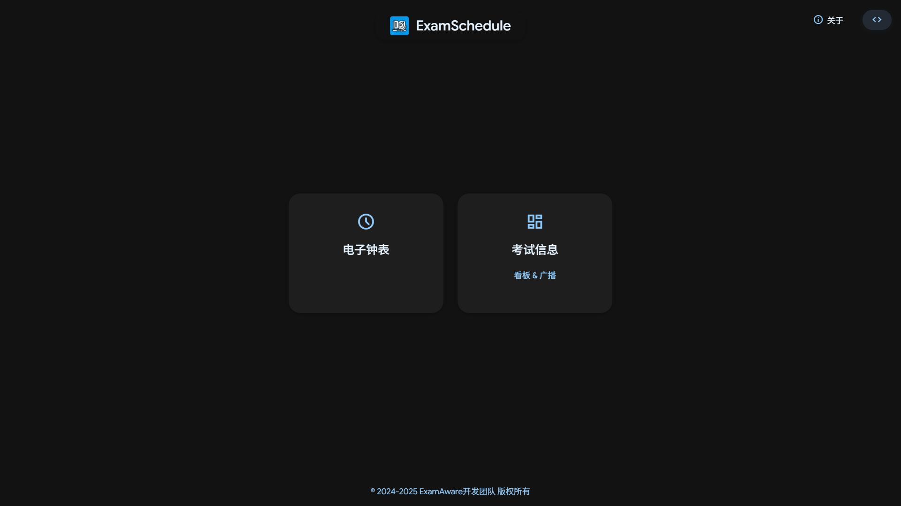
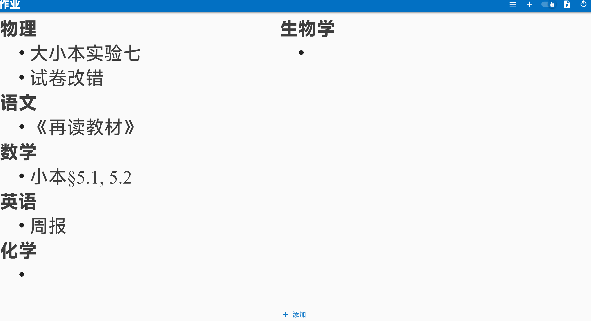
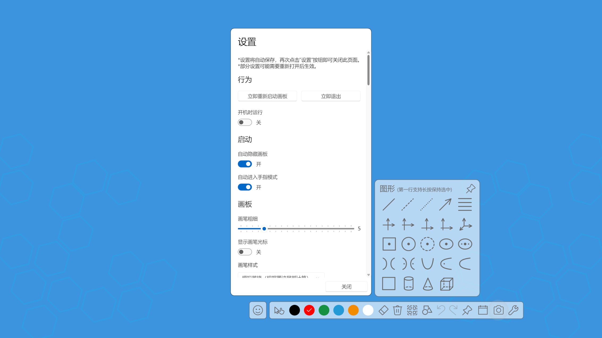
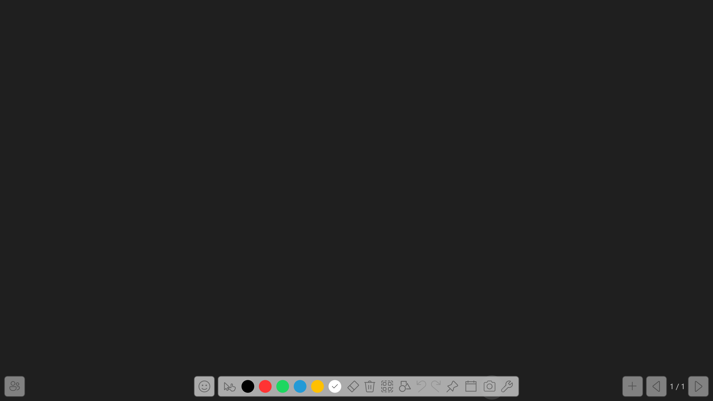
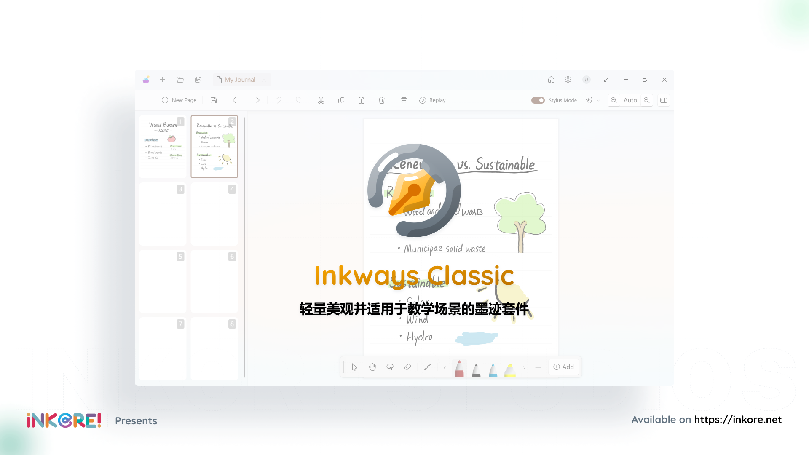
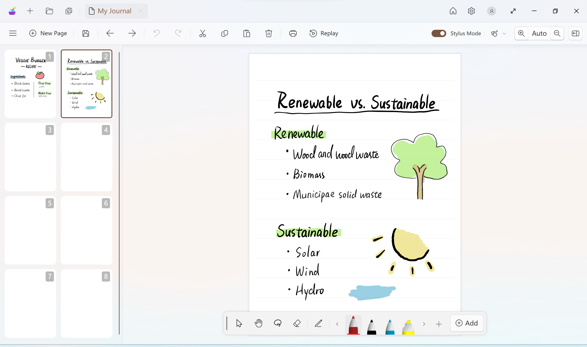
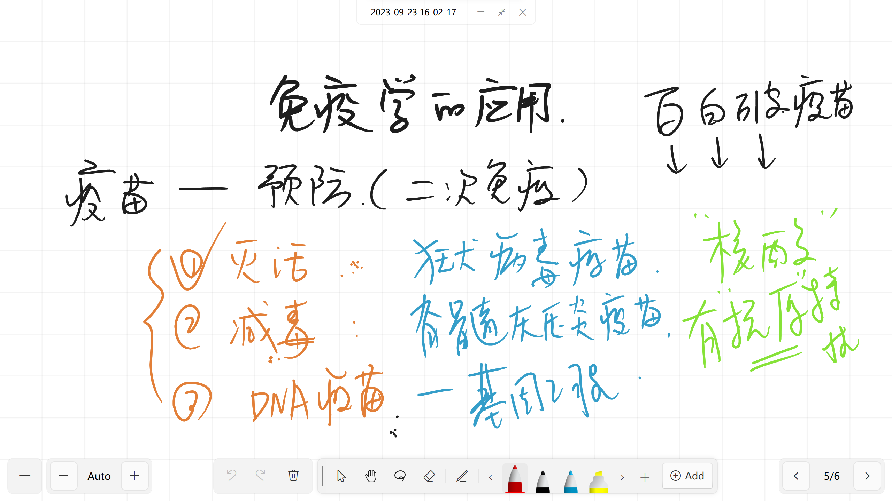
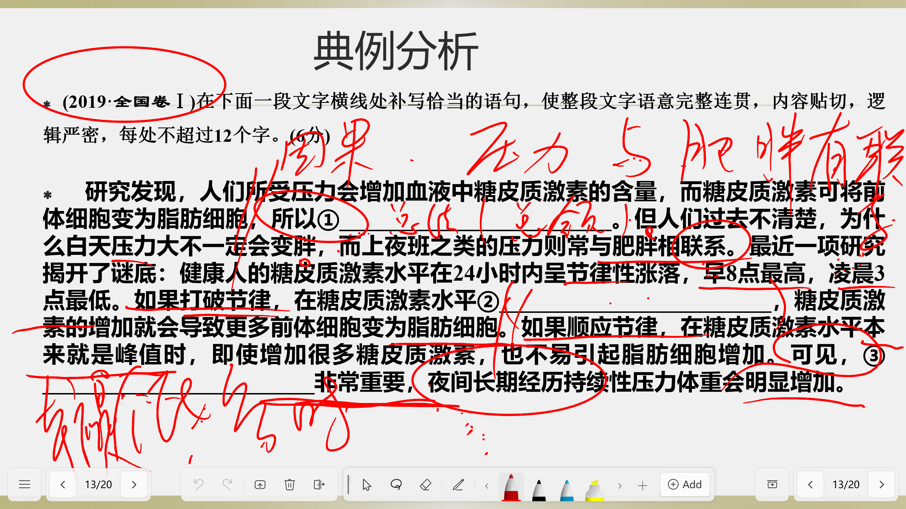
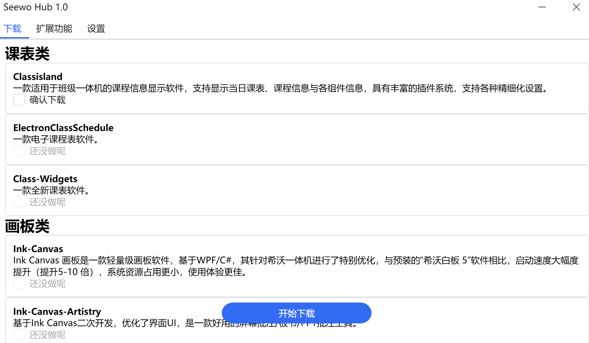
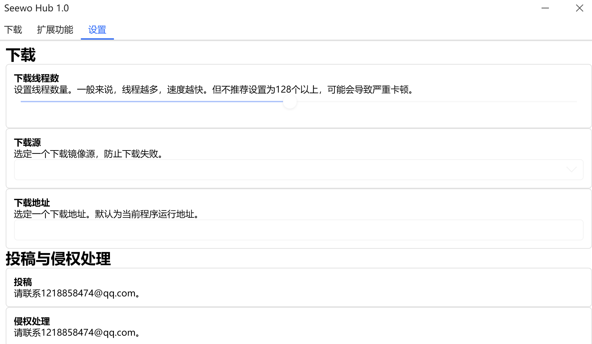

# Awesome Class Softwares
# 适用于班级一体机的优质软件列表

> [!important]
> **本文档旨在推荐以下优质软件，如欲提出问题，请前往对应仓库/交流平台**🔗
>
> **对于软件详细介绍与使用方法，请点击对应 Web 页面链接跳转到网站相关页面**🔗
>
> **本文档仅供参考，信息可能会更新不及时，请前往对应仓库查看最新动态**
>
> **若发现任何错误/过时/遗漏信息，或希望推荐新软件，欢迎提交 [`Issues`](https://github.com/Jursin/Awesome-Class-Softwares/issues) 使我知晓或 [`Pull Requests`](https://github.com/Jursin/Awesome-Class-Softwares/pulls) 等待合并。**

> [!warning]
> **以下软件均为免费，如遇收费提示请注意甄别！**
>
> **🚫严禁上传违法敏感内容，⚠️请在遵守中华人民共和国相关法律规定和您所在地区的地方法律法规的情况下上传合法内容**

> [!tip]
> **你知道吗？**
> 
> **以下项目开发者基本都是学生**🤓
> 
> **以下徽章大部分点击后可跳转到对应链接**🔗

> **👋同类项目**

## 📃目录

### 🗓️[课表类](#🗓️课表类)

| 软件 | 组织/主开发者 |
| - | - |
| [CsesWebEditor](#cseswebeditor) |   [`SmartTeachCN`](https://github.com/SmartTeachCN)  [`PYLXU`](https://github.com/PYLXU) |
|  [ClassIsland](#classisland) |   [`ClassIsland`](https://github.com/ClassIsland)  [`HelloWRC`](https://github.com/HelloWRC) |
|  [Class-Widgets](#class-widgets) |  [`Class-Widgets`](https://github.com/Class-Widgets)  [`RinLit-233-shiroko`](https://github.com/RinLit-233-shiroko) |
|  [LingYun-Class-Widgets](#lingyun-class-widgets) |  [`Yamikani-Flipped`](https://github.com/Yamikani-Flipped) |
|  [ElectronClassSchedule](#electronclassschedule) |  [`EnderWolf006`](https://github.com/EnderWolf006) |
|  [iClass](#iclass) |  [`gpuawa`](https://github.com/gpuawa) |

### 🧩[多功能类](#🧩多功能类)

| 软件 | 组织/主开发者 |
| - | - |
|  [Ris_ClassTool](#ris_classtool) |  [`Ris-Soft`](https://github.com/Ris-Soft)  [`PYLXU`](https://github.com/PYLXU) |
|  [ZongziTEK黑板贴](#zongzitek黑板贴) |  [`STBBRD`](https://github.com/STBBRD) |

### 📊[看板类](#📊看板类)

| 软件 | 组织/主开发者 |
| - | - |
|  [ExamAware](#examaware) |  [`ExamAware`](https://github.com/ExamAware)  [`Hello8693`](https://github.com/Hello8693) |
|  [Sticky-attention](#sticky-attention) |  [`Sticky-attention`](https://github.com/Sticky-attention)  [`jizilin6732`](https://github.com/jizilin6732) |
|  [HomeworkBoard](#homeworkboard) |  [`EnderWolf006`](https://github.com/EnderWolf006) |
|  [Classworks](#classworks) |  [`ClassworksDev`](https://github.com/ClassworksDev)  [`SunWuyuan`](https://github.com/SunWuyuan) |

### 🖍️[批注类](#🖍️批注类)

| 软件 | 组织/主开发者 |
| - | - |
|  [Ink-Canvas](#ink-canvas) |  [`WXRIW`](https://github.com/WXRIW) |
|  [Ink-Canvas-Plus](#ink-canvas-plus) |  [`clover-yan`](https://github.com/clover-yan/) |
|  [Ink-Canvas-Artistry](#ink-canvas-artistry) |  [`InkCanvas`](https://github.com/InkCanvas)  [`ChangSakura`](https://github.com/ChangSakura) |
|  [InkCanvasForClass](#inkcanvasforclass) |  [`InkCanvas`](https://github.com/InkCanvas)  [`CJKmkp`](https://github.com/CJKmkp) |
|  [SketchNow](#sketchnow) |  [`SketchNow`](https://github.com/SketchNow)  [`realybin`](https://github.com/realybin) |
|  [智绘教Inkeys](#智绘教inkeys) |  [`Alan-CRL`](https://github.com/Alan-CRL) |
|  [Inkways-Classic](#inkways-classic) |  [`iNKORE Studios`](https://github.com/iNKORE-NET) |
|  [LemonxNote](#lemonxnote) |  [`lh11117`](https://github.com/lh11117) |

### ⬇️[下载/启动器](#⬇️下载/启动器)

| 软件 | 组织/主开发者 |
| - | - |
|  [SectionIstool](#SectionIstool) |  [`SectionIstool`](https://github.com/SectionIstool)  [`lzy98276`](https://github.com/lzy98276) |
|  [SeewoHUB](#seewohub) |  [`CNwenwen`](https://github.com/CNwenwen) |

### 🎲[杂项](#🎲杂项)

| 软件 | 组织/主开发者 |
| - | - |
|  [NamePicker](#namepicker) |  [`NamePicker`](https://github.com/NamePickerOrg)  [`LHGS-github`](https://github.com/LHGS-github) |
|  [Rand](#rand) |  [`LuoYunXi0407`](https://github.com/LuoYunXi0407) |
|  [SecRandom](#secrandom) |  [`lzy98276`](https://github.com/lzy98276) |

## 🗓️课表类
### CsesWebEditor

一个基于 Web 的课程表编辑器，支持 CSES 格式的课程表创建、管理和导出｜[在线使用](https://edit.cses-org.cn/)

|  **GitHub 仓库** |[https://github.com/SmartTeachCN/CsesWebEditor](https://github.com/SmartTeachCN/CsesWebEditor) |
| - | - |
| **Web 页面** | [./classschedule/cses.html](https://jursin.github.io/Awesome-Class-Softwares-Web/classschedule/cses.html)

<image src="https://github.com/ClassIsland/ClassIsland/blob/master/ClassIsland/Assets/AppLogo_AppLogo.svg?raw=true" height="64">

### ClassIsland

一款适用于班级一体机的课程信息显示软件，支持显示当日课表、课程信息与各`组件`信息，具有丰富的`插件系统`，支持各种精细化设置。

<image src="https://github.com/ClassIsland/ClassIsland/blob/master/ClassIsland/Assets/AppLogo_AppLogo.svg?raw=true" height="16"/>[ClassIsland 官网](https://classisland.tech/)｜[ClassIsland 文档](https://docs.classisland.tech)｜[ClassIsland 投票](https://github.com/ClassIsland/voting/discussions)

|  **GitHub 仓库** | [https://github.com/ClassIsland/ClassIsland](https://github.com/ClassIsland/ClassIsland) |
| - | - |
|  **`.NET 6`兼容版仓库** | [https://github.com/ClassIsland/ClassIsland-net6](https://github.com/ClassIsland/ClassIsland-net6)（可在`Windows 7`上正常运行） |
|  **GitHub 发行版** | [https://github.com/ClassIsland/ClassIsland/releases](https://github.com/ClassIsland/ClassIsland/releases) |
| **Web 页面** | [./classschedule/classisland/](https://jursin.github.io/Awesome-Class-Softwares-Web/classschedule/classisland/)

<image src="https://github.com/Class-Widgets/Class-Widgets/blob/main/img%2FLogo.png?raw=true" height="64">

### Class-Widgets

 

一款全新课表软件｜[Class-Widgets 官网](https://classwidgets.rinlit.cn/)｜[Class-Widgets 使用文档](https://www.yuque.com/rinlit/class-widgets_help)

|  **GitHub 仓库** | [https://github.com/Class-Widgets/Class-Widgets](https://github.com/Class-Widgets/Class-Widgets) |
| - | - |
|  **GitHub 发行版** | [https://github.com/Class-Widgets/Class-Widgets/releases](https://github.com/Class-Widgets/Class-Widgets/releases) |
| **Web 页面** | [./classschedule/class-widgets/](https://jursin.github.io/Awesome-Class-Softwares-Web/classschedule/class-widgets/)

<image src="https://raw.githubusercontent.com/Yamikani-Flipped/LingYun-Class-Widgets/main/LINGYUN.ico" height="64">

### LingYun-Class-Widgets

一款功能丰富的桌面工具，支持在桌面显示各种组件，支持 CSES 通用课程表格式｜[LingYun Class Widgets 官网](https://lingyun-6e2.pages.dev/)

|  **GitHub 仓库** | [https://github.com/Yamikani-Flipped/LingYun-Class-Widgets](https://github.com/Yamikani-Flipped/LingYun-Class-Widgets) |
| - | - |
|  **GitHub 发行版** | [https://github.com/Yamikani-Flipped/LingYun-Class-Widgets/releases](https://github.com/Yamikani-Flipped/LingYun-Class-Widgets/releases) |
| **Web 页面** | [./classschedule/lingyun-class-widgets](https://jursin.github.io/Awesome-Class-Softwares-Web/classschedule/lingyun-class-widgets/)

<image src="https://github.com/EnderWolf006/ElectronClassSchedule/blob/main/image%2Ficon.png?raw=true" height="64">

### ElectronClassSchedule

 

一款电子课程表软件｜[使用说明](https://github.com/EnderWolf006/ElectronClassSchedule?tab=readme-ov-file#%E9%A3%9F%E7%94%A8%E8%AF%B4%E6%98%8E)

|  **GitHub 仓库** | [https://github.com/EnderWolf006/ElectronClassSchedule](https://github.com/EnderWolf006/ElectronClassSchedule) |
| - | - |
|  **GitHub 发行版** | [https://github.com/EnderWolf006/ElectronClassSchedule/releases](https://github.com/EnderWolf006/ElectronClassSchedule/releases) |
| **Web 页面** | [./classschedule/electronclassschedule](https://jursin.github.io/Awesome-Class-Softwares-Web/classschedule/electronclassschedule/) |

<image src="https://raw.githubusercontent.com/gpuawa/iClass/refs/heads/main/src/assets/img/logo.ico" height="64">

### iClass

 

 

原名 **ESC++，iMagicTools** ，一个简单的课表软件，使用 Electron 框架

 |  **GitHub 仓库** | [https://github.com/gpuawa/iClass](https://github.com/gpuawa/iClass) |
 | - | - |
|  **GitHub 发行版** | [https://github.com/gpuawa/iClass/releases](https://github.com/gpuawa/iClass/releases) |
| **Web 页面** | [./classschedule/iclass](https://jursin.github.io/Awesome-Class-Softwares-Web/classschedule/iclass/) |

## 🧩多功能类

<image src="https://github.com/Ris-Soft/Ris_ClassTool/blob/RisClassTool_Alpha/Main/logo.png?raw=true" height="64">

### Ris_ClassTool

瑞思课堂工具｜[Ris_ClassTool 下载站](https://app.3r60.top/Ris_ClassTool)

|  **GitHub 仓库** |[https://github.com/Ris-Soft/Ris_ClassTool](https://github.com/Ris-Soft/Ris_ClassTool) |
| - | - |
|  **GitHub 发行版** | [https://github.com/Ris-Soft/Ris_ClassTool/releases](https://github.com/Ris-Soft/Ris_ClassTool/releases) |
| **Web 页面** | [./multi-function/ris_classtool](https://jursin.github.io/Awesome-Class-Softwares-Web/multi-function/ris_classtool/) |

<image src="https://github.com/STBBRD/ZongziTEK-Blackboard-Sticker/blob/master/ZongziTEK_Blackboard_Sticker%2F%E9%BB%91%E6%9D%BF%E8%B4%B4.png?raw=true" height="64">

### ZongziTEK黑板贴

 

用于班级一体机的桌面小部件｜[ZongziTEK黑板贴官网](https://zztek.top/)

|  **GitHub 仓库** | [https://github.com/STBBRD/ZongziTEK-Blackboard-Sticker](https://github.com/STBBRD/ZongziTEK-Blackboard-Sticker) |
| - | - |
|  **GitHub 发行版** | [https://github.com/STBBRD/ZongziTEK-Blackboard-Sticker/releases](https://github.com/STBBRD/ZongziTEK-Blackboard-Sticker/releases) |
| **Web 页面** | [./multi-function/zongzitek-blackboard-sticker](https://jursin.github.io/Awesome-Class-Softwares-Web/multi-function/zongzitek-blackboard-sticker/)

## 📊看板类

### ExamAware

#### ExamShowboard-Legacy

一款显示当前时间与考试详细信息的显示工具｜[网页版在线体验](http://examboard.cn/)

|  **GitHub 仓库** | [https://github.com/ExamAware/ExamShowboard-Legacy](https://github.com/ExamAware/ExamShowboard-Legacy) |
| - | - |
|  **GitHub 发行版** | [https://github.com/ExamAware/ExamShowboard-Legacy/releases](https://github.com/ExamAware/ExamShowboard-Legacy/releases) |
| **Web 页面** | [./dashboard/examaware/exam-showboard](https://jursin.github.io/Awesome-Class-Softwares-Web/dashboard/examaware/exam-showboard)

#### ExamSchedule

网页版考试看板｜[网页版在线体验](https://es.examaware.tech/)

|  **GitHub 仓库** | [https://github.com/ExamAware/ExamSchedule](https://github.com/ExamAware/ExamSchedule) |
| - | - |
|  **GitHub 发行版** | [https://github.com/ExamAware/ExamSchedule/releases](https://github.com/ExamAware/ExamSchedule/releases) |
| **Web 页面** | [./dashboard/examaware/examschedule](https://jursin.github.io/Awesome-Class-Softwares-Web/dashboard/examaware/examschedule)

<image src="https://avatars.githubusercontent.com/u/183182916?s=200&v=4" height="64">

### Sticky-attention

forked from 
<image src="https://github.com/HelloWRC/StickyHomeworks/blob/master/StickyHomeworks/Assets/AppLogo.png?raw=true" height="16"> [HelloWRC/StickyHomeworks](https://github.com/HelloWRC/StickyHomeworks)

 

一款适用于 Windows 系统教室一体机的作业显示工具，可以展示各科作业

|  **GitHub 仓库** | [https://github.com/Sticky-attention/Sticky-attention](https://github.com/Sticky-attention/Sticky-attention) |
| - | - |
|  **GitHub 发行版** | [https://github.com/Sticky-attention/Sticky-attention/releases](https://github.com/Sticky-attention/Sticky-attention/releases) |
| **Web 页面** | [./dashboard/sticky-attention](https://jursin.github.io/Awesome-Class-Softwares-Web/dashboard/sticky-attention)

<image src="https://github.com/EnderWolf006/HomeworkBoard/blob/main/ClientProject/public/vite.svg?raw=true" height="64">

### HomeworkBoard

一款支持云同步的作业展示板软件｜[使用说明](https://github.com/EnderWolf006/HomeworkBoard?tab=readme-ov-file#%E9%A3%9F%E7%94%A8%E8%AF%B4%E6%98%8E)

|  **GitHub 仓库** | [https://github.com/EnderWolf006/HomeworkBoard](https://github.com/EnderWolf006/HomeworkBoard) |
| - | - |
|  **GitHub 发行版** | [https://github.com/EnderWolf006/HomeworkBoard/releases](https://github.com/EnderWolf006/HomeworkBoard/releases) |
| **Web 页面** | [./dashboard/homeworkboard](https://jursin.github.io/Awesome-Class-Softwares-Web/dashboard/homeworkboard)

<image src="https://zerocat.houlangs.com/favicon.png" height="64">

### Classworks

基于 Vue 3 + Vuetify 的现代化作业管理系统前端项目｜[ZeroCat 官网](https://zerocat.houlangs.com)

|  **GitHub 仓库** | [https://github.com/ClassworksDev/Classworks](https://github.com/ClassworksDev/Classworks) |
| - | - |
|  **GitHub 发行版** | [https://github.com/ClassworksDev/Classworks/releases](https://github.com/ClassworksDev/Classworks/releases) |
| **Web 页面** | [./dashboard/classworks](https://jursin.github.io/Awesome-Class-Softwares-Web/dashboard/classworks)

## 🖍️批注类

<image src="https://github.com/WXRIW/Ink-Canvas/blob/master/Ink%20Canvas%2FResources%2FInkCanvas.png?raw=true" height="64">

### Ink-Canvas

Ink Canvas 画板是一款轻量级画板软件，基于WPF/C#，其针对希沃一体机进行了特别优化，与预装的“希沃白板 5”软件相比，启动速度大幅度提升（提升5-10 倍），系统资源占用更小，使用体验更佳。

[使用指南](https://github.com/WXRIW/Ink-Canvas/blob/master/Manual.md/) | [常见问题](https://github.com/WXRIW/Ink-Canvas?tab=readme-ov-file#-faq)

|  **GitHub 仓库** | [https://github.com/WXRIW/Ink-Canvas](https://github.com/WXRIW/Ink-Canvas) |
| - | - |
|  **GitHub 发行版** | [https://github.com/WXRIW/Ink-Canvas/releases](https://github.com/WXRIW/Ink-Canvas/releases) |
| **Web 页面** | [./annotation/ink-canvas](https://jursin.github.io/Awesome-Class-Softwares-Web/annotation/ink-canvas)

<image src="https://raw.githubusercontent.com/clover-yan/Ink-Canvas-Plus/refs/heads/master/Ink%20Canvas/Resources/InkCanvas.png" height="64">

### Ink-Canvas-Plus

![C#](https://img.shields.io/badge/C%23-blue?logo=data:image/svg+xml;base64,PHN2ZyBoZWlnaHQ9IjI4OCIgcHJlc2VydmVBc3BlY3RSYXRpbz0ieE1pZFlNaWQiIHZpZXdCb3g9IjAgMCAyNTYgMjg4IiB3aWR0aD0iMjU2IiB4bWxucz0iaHR0cDovL3d3dy53My5vcmcvMjAwMC9zdmciPjxwYXRoIGQ9Im0yNTUuNTY5IDg0LjQ1MjM3NmMtLjAwMi00LjgzLTEuMDM1LTkuMDk4LTMuMTI0LTEyLjc2MS0yLjA1Mi0zLjYwMi01LjEyNS02LjYyMS05LjI0Ny05LjAwOC0zNC4wMjUtMTkuNjE5LTY4LjA4My0zOS4xNzgtMTAyLjA5Ny01OC44MTY5OTk5NS05LjE3LTUuMjk0LTE4LjA2MS01LjEwMS0yNy4xNjMuMjY5LTEzLjU0MyA3Ljk4Njk5OTk1LTgxLjM0OCA0Ni44MzM5OTk5NS0xMDEuNTUzIDU4LjUzNjk5OTk1LTguMzIxIDQuODE3LTEyLjM3IDEyLjE4OS0xMi4zNzIgMjEuNzcxLS4wMTMgMzkuNDU1IDAgNzguOTA5LS4wMTMgMTE4LjM2NSAwIDQuNzI0Ljk5MSA4LjkwOSAyLjk4OCAxMi41MTcgMi4wNTMgMy43MTEgNS4xNjkgNi44MTMgOS4zODYgOS4yNTQgMjAuMjA2IDExLjcwMyA4OC4wMiA1MC41NDcgMTAxLjU2IDU4LjUzNiA5LjEwNiA1LjM3MyAxNy45OTcgNS41NjUgMjcuMTcuMjY5IDM0LjAxNS0xOS42NCA2OC4wNzUtMzkuMTk4IDEwMi4xMDUtNTguODE3IDQuMjE3LTIuNDQgNy4zMzMtNS41NDQgOS4zODYtOS4yNTIgMS45OTQtMy42MDggMi45ODctNy43OTMgMi45ODctMTIuNTE4IDAgMCAwLTc4Ljg4OS0uMDEzLTExOC4zNDUiIGZpbGw9IiNhMTc5ZGMiLz48cGF0aCBkPSJtMTI4LjE4MiAxNDMuMjQxMzc2LTEyNS4xOTQgNzIuMDg0YzIuMDUzIDMuNzExIDUuMTY5IDYuODEzIDkuMzg2IDkuMjU0IDIwLjIwNiAxMS43MDMgODguMDIgNTAuNTQ3IDEwMS41NiA1OC41MzYgOS4xMDYgNS4zNzMgMTcuOTk3IDUuNTY1IDI3LjE3LjI2OSAzNC4wMTUtMTkuNjQgNjguMDc1LTM5LjE5OCAxMDIuMTA1LTU4LjgxNyA0LjIxNy0yLjQ0IDcuMzMzLTUuNTQ0IDkuMzg2LTkuMjUyeiIgZmlsbD0iIzI4MDA2OCIvPjxwYXRoIGQ9Im0yNTUuNTY5IDg0LjQ1MjM3NmMtLjAwMi00LjgzLTEuMDM1LTkuMDk4LTMuMTI0LTEyLjc2MWwtMTI0LjI2MyA3MS41NSAxMjQuNDEzIDcyLjA3NGMxLjk5NC0zLjYwOCAyLjk4NS03Ljc5MyAyLjk4Ny0xMi41MTggMCAwIDAtNzguODg5LS4wMTMtMTE4LjM0NSIgZmlsbD0iIzM5MDA5MSIvPjxnIGZpbGw9IiNmZmYiPjxwYXRoIGQ9Im0yMDEuODkyMzI2IDExNi4yOTQwMDh2MTMuNDczNjg0aDEzLjQ3MzY4NHYtMTMuNDczNjg0aDYuNzM2ODQydjEzLjQ3MzY4NGgxMy40NzM2ODV2Ni43MzY4NDJoLTEzLjQ3MzY4NXYxMy40NzM2ODRoMTMuNDczNjg1djYuNzM2ODQyaC0xMy40NzM2ODV2MTMuNDczNjg0aC02LjczNjg0MnYtMTMuNDczNjg0aC0xMy40NzM2ODR2MTMuNDczNjg0aC02LjczNjg0MnYtMTMuNDczNjg0aC0xMy40NzM2ODR2LTYuNzM2ODQyaDEzLjQ3MzY4NHYtMTMuNDczNjg0aC0xMy40NzM2ODR2LTYuNzM2ODQyaDEzLjQ3MzY4NHYtMTMuNDczNjg0em0xMy40NzM2ODQgMjAuMjEwNTI2aC0xMy40NzM2ODR2MTMuNDczNjg0aDEzLjQ3MzY4NHoiLz48cGF0aCBkPSJtMTI4LjQ1Njc1MiA0OC42MjU4NzZjMzUuMTQzNzcxIDAgNjUuODI3MTMzIDE5LjA4NjI5ODEgODIuMjYxODEgNDcuNDU2MDY3NWwtLjE2MDM3LS4yNzMwNjc1LTQxLjM0ODU3NyAyMy44MDgyODNjLTguMTQ2NjU2LTEzLjc5MzYwNS0yMy4wODE0NzktMjMuMTAyMDg3My00MC4yMTMyMzItMjMuMjkzNzg2OGwtLjUzOTYzMS0uMDAzMDE3OGMtMjYuMTI1NTc0IDAtNDcuMzA2MDgxNSAyMS4xNzkzODg2LTQ3LjMwNjA4MTUgNDcuMzA0OTYxNiAwIDguNTQzNjE1IDIuMjc3Nzc0OCAxNi41NTIyMDQgNi4yMzg5NzY0IDIzLjQ2OTQ3NiA4LjE1NDA5ODEgMTQuMjM1MjUzIDIzLjQ4MjkwNzEgMjMuODM2NjA2IDQxLjA2NzEwNTEgMjMuODM2NjA2IDE3LjY5Mjc3IDAgMzMuMTA4ODg0LTkuNzIzMzU3IDQxLjIyMTU2OC0yNC4xMTA4MzVsLS4xOTcxMjguMzQ1MzEzIDQxLjI4NjQ4NiAyMy45MTgwMzdjLTE2LjI1NDM5OCAyOC4xMjk1NTctNDYuNTE3NDA4IDQ3LjE1Njk0OC04MS4yNTI3MDEgNDcuNTM2MTg5bC0xLjA1ODIyNS4wMDU3NzRjLTM1LjI1NDU4MTkgMC02Ni4wMjUyNDkyLTE5LjIwMzgyNC04Mi40MTg1MTIyLTQ3LjcyMzU4LTguMDAyOTkyNy0xMy45MjI5NjktMTIuNTgyMDQ3Ni0zMC4wNjQzODktMTIuNTgyMDQ3Ni00Ny4yNzY5OCAwLTUyLjQ2NjA1MjQgNDIuNTMyMjY4Mi05NC45OTk0NCA5NS4wMDA1NTk4LTk0Ljk5OTQ0eiIvPjwvZz48L3N2Zz4=)

Ink Canvas Plus (IC+) 是一款由 Clover Yan 维护、复刻自 [WXRIW/Ink Canvas](https://github.com/WXRIW/Ink-Canvas) 的 Windows 画板应用，旨在优化各方面的使用体验，并尽可能保留原版 Ink Canvas 的操作体验。

[使用指南](https://github.com/clover-yan/Ink-Canvas-Plus/blob/master/Manual.md/) | [常见问题](https://github.com/clover-yan/Ink-Canvas-Plus?tab=readme-ov-file#-faq)｜[Ink-Canvas-Plus 官网](https://www.khyan.top/apps/Ink-Canvas-Plus/)

|  **GitHub 仓库** | [https://github.com/clover-yan/Ink-Canvas-Plus](https://github.com/clover-yan/Ink-Canvas-Plus) |
| - | - |
|  **GitHub 发行版** | [https://github.com/clover-yan/Ink-Canvas-Plus/releases](https://github.com/clover-yan/Ink-Canvas-Plus/releases) |
| **Web 页面** | [./annotation/ink-canvas-plus](https://jursin.github.io/Awesome-Class-Softwares-Web/annotation/ink-canvas-plus)

<image src="https://github.com/ChangSakura/Ink-Canvas/blob/master/Images/Ink%20Canvas%20Artistry.png" height="64">

### Ink-Canvas-Artistry

forked from <image src="https://github.com/WXRIW/Ink-Canvas/blob/master/Ink%20Canvas%2FResources%2FInkCanvas.png?raw=true" height="16"> [WXRIW/Ink-Canvas](https://github.com/WXRIW/Ink-Canvas)

基于 [Ink Canvas](https://github.com/WXRIW/Ink-Canvas) 二次开发，优化了界面UI，是一款好用的屏幕批注/板书/PPT批注工具｜[常见问题](https://github.com/InkCanvas/Ink-Canvas-Artistry?tab=readme-ov-file#-faq)

|  **GitHub 仓库** | [https://github.com/ChangSakura/Ink-Canvas](https://github.com/ChangSakura/Ink-Canvas) |
| - | - |
|  **GitHub 发行版** | [https://github.com/ChangSakura/Ink-Canvas/releases](https://github.com/ChangSakura/Ink-Canvas/releases) |
| **Web 页面** | [./annotation/ink-canvas-artistry](https://jursin.github.io/Awesome-Class-Softwares-Web/annotation/ink-canvas-artistry)

### InkCanvasForClass

![C#](https://img.shields.io/badge/C%23-blue?logo=data:image/svg+xml;base64,PHN2ZyBoZWlnaHQ9IjI4OCIgcHJlc2VydmVBc3BlY3RSYXRpbz0ieE1pZFlNaWQiIHZpZXdCb3g9IjAgMCAyNTYgMjg4IiB3aWR0aD0iMjU2IiB4bWxucz0iaHR0cDovL3d3dy53My5vcmcvMjAwMC9zdmciPjxwYXRoIGQ9Im0yNTUuNTY5IDg0LjQ1MjM3NmMtLjAwMi00LjgzLTEuMDM1LTkuMDk4LTMuMTI0LTEyLjc2MS0yLjA1Mi0zLjYwMi01LjEyNS02LjYyMS05LjI0Ny05LjAwOC0zNC4wMjUtMTkuNjE5LTY4LjA4My0zOS4xNzgtMTAyLjA5Ny01OC44MTY5OTk5NS05LjE3LTUuMjk0LTE4LjA2MS01LjEwMS0yNy4xNjMuMjY5LTEzLjU0MyA3Ljk4Njk5OTk1LTgxLjM0OCA0Ni44MzM5OTk5NS0xMDEuNTUzIDU4LjUzNjk5OTk1LTguMzIxIDQuODE3LTEyLjM3IDEyLjE4OS0xMi4zNzIgMjEuNzcxLS4wMTMgMzkuNDU1IDAgNzguOTA5LS4wMTMgMTE4LjM2NSAwIDQuNzI0Ljk5MSA4LjkwOSAyLjk4OCAxMi41MTcgMi4wNTMgMy43MTEgNS4xNjkgNi44MTMgOS4zODYgOS4yNTQgMjAuMjA2IDExLjcwMyA4OC4wMiA1MC41NDcgMTAxLjU2IDU4LjUzNiA5LjEwNiA1LjM3MyAxNy45OTcgNS41NjUgMjcuMTcuMjY5IDM0LjAxNS0xOS42NCA2OC4wNzUtMzkuMTk4IDEwMi4xMDUtNTguODE3IDQuMjE3LTIuNDQgNy4zMzMtNS41NDQgOS4zODYtOS4yNTIgMS45OTQtMy42MDggMi45ODctNy43OTMgMi45ODctMTIuNTE4IDAgMCAwLTc4Ljg4OS0uMDEzLTExOC4zNDUiIGZpbGw9IiNhMTc5ZGMiLz48cGF0aCBkPSJtMTI4LjE4MiAxNDMuMjQxMzc2LTEyNS4xOTQgNzIuMDg0YzIuMDUzIDMuNzExIDUuMTY5IDYuODEzIDkuMzg2IDkuMjU0IDIwLjIwNiAxMS43MDMgODguMDIgNTAuNTQ3IDEwMS41NiA1OC41MzYgOS4xMDYgNS4zNzMgMTcuOTk3IDUuNTY1IDI3LjE3LjI2OSAzNC4wMTUtMTkuNjQgNjguMDc1LTM5LjE5OCAxMDIuMTA1LTU4LjgxNyA0LjIxNy0yLjQ0IDcuMzMzLTUuNTQ0IDkuMzg2LTkuMjUyeiIgZmlsbD0iIzI4MDA2OCIvPjxwYXRoIGQ9Im0yNTUuNTY5IDg0LjQ1MjM3NmMtLjAwMi00LjgzLTEuMDM1LTkuMDk4LTMuMTI0LTEyLjc2MWwtMTI0LjI2MyA3MS41NSAxMjQuNDEzIDcyLjA3NGMxLjk5NC0zLjYwOCAyLjk4NS03Ljc5MyAyLjk4Ny0xMi41MTggMCAwIDAtNzguODg5LS4wMTMtMTE4LjM0NSIgZmlsbD0iIzM5MDA5MSIvPjxnIGZpbGw9IiNmZmYiPjxwYXRoIGQ9Im0yMDEuODkyMzI2IDExNi4yOTQwMDh2MTMuNDczNjg0aDEzLjQ3MzY4NHYtMTMuNDczNjg0aDYuNzM2ODQydjEzLjQ3MzY4NGgxMy40NzM2ODV2Ni43MzY4NDJoLTEzLjQ3MzY4NXYxMy40NzM2ODRoMTMuNDczNjg1djYuNzM2ODQyaC0xMy40NzM2ODV2MTMuNDczNjg0aC02LjczNjg0MnYtMTMuNDczNjg0aC0xMy40NzM2ODR2MTMuNDczNjg0aC02LjczNjg0MnYtMTMuNDczNjg0aC0xMy40NzM2ODR2LTYuNzM2ODQyaDEzLjQ3MzY4NHYtMTMuNDczNjg0aC0xMy40NzM2ODR2LTYuNzM2ODQyaDEzLjQ3MzY4NHYtMTMuNDczNjg0em0xMy40NzM2ODQgMjAuMjEwNTI2aC0xMy40NzM2ODR2MTMuNDczNjg0aDEzLjQ3MzY4NHoiLz48cGF0aCBkPSJtMTI4LjQ1Njc1MiA0OC42MjU4NzZjMzUuMTQzNzcxIDAgNjUuODI3MTMzIDE5LjA4NjI5ODEgODIuMjYxODEgNDcuNDU2MDY3NWwtLjE2MDM3LS4yNzMwNjc1LTQxLjM0ODU3NyAyMy44MDgyODNjLTguMTQ2NjU2LTEzLjc5MzYwNS0yMy4wODE0NzktMjMuMTAyMDg3My00MC4yMTMyMzItMjMuMjkzNzg2OGwtLjUzOTYzMS0uMDAzMDE3OGMtMjYuMTI1NTc0IDAtNDcuMzA2MDgxNSAyMS4xNzkzODg2LTQ3LjMwNjA4MTUgNDcuMzA0OTYxNiAwIDguNTQzNjE1IDIuMjc3Nzc0OCAxNi41NTIyMDQgNi4yMzg5NzY0IDIzLjQ2OTQ3NiA4LjE1NDA5ODEgMTQuMjM1MjUzIDIzLjQ4MjkwNzEgMjMuODM2NjA2IDQxLjA2NzEwNTEgMjMuODM2NjA2IDE3LjY5Mjc3IDAgMzMuMTA4ODg0LTkuNzIzMzU3IDQxLjIyMTU2OC0yNC4xMTA4MzVsLS4xOTcxMjguMzQ1MzEzIDQxLjI4NjQ4NiAyMy45MTgwMzdjLTE2LjI1NDM5OCAyOC4xMjk1NTctNDYuNTE3NDA4IDQ3LjE1Njk0OC04MS4yNTI3MDEgNDcuNTM2MTg5bC0xLjA1ODIyNS4wMDU3NzRjLTM1LjI1NDU4MTkgMC02Ni4wMjUyNDkyLTE5LjIwMzgyNC04Mi40MTg1MTIyLTQ3LjcyMzU4LTguMDAyOTkyNy0xMy45MjI5NjktMTIuNTgyMDQ3Ni0zMC4wNjQzODktMTIuNTgyMDQ3Ni00Ny4yNzY5OCAwLTUyLjQ2NjA1MjQgNDIuNTMyMjY4Mi05NC45OTk0NCA5NS4wMDA1NTk4LTk0Ljk5OTQ0eiIvPjwvZz48L3N2Zz4=)

一款基于 [Ink-Canvas-Artistry](https://github.com/ChangSakura/Ink-Canvas) 的开源易用的电子教鞭软件，专为课堂教学场景优化设计

> [!warning]
> 二次开发仓库（均已存档）
>
> - [Ink-Canvas-reborn](https://github.com/Awesome-Iwb/Ink-Canvas-Reborn)
>
> - [icc-20240610-stable](https://github.com/Awesome-Iwb/icc-20240610-stable)
>
> - [icc-latest-20250607-unstable](https://github.com/Awesome-Iwb/icc-latest-20250607-unstable)

#### InkCanvasForClass Community Edition
在 [`icc-20240610-stable`](https://github.com/Awesome-Iwb/icc-20240610-stable) 基础上二次开发的又一个版本，目前仍在积极维护

|  **GitHub 仓库** | [https://github.com/InkCanvas/InkCanvasForClass](https://github.com/InkCanvas/InkCanvasForClass)**（已存档）** |
| - | - |
|  **社区版 GitHub 仓库** | [https://github.com/InkCanvasForClass/community](https://github.com/InkCanvasForClass/community) |
|  **社区版 GitHub 发行版** | [https://github.com/InkCanvasForClass/community/releases](https://github.com/InkCanvasForClass/community/releases) |
| **Web 页面** | [./annotation/inkcanvasforclass](https://jursin.github.io/Awesome-Class-Softwares-Web/annotation/inkcanvasforclass) |

<image src="https://github.com/SketchNow/SketchNow.WPF/blob/main/SketchNow%2FResources%2FAppIcon.ico?raw=true" height="64">

### SketchNow

一款让您能在屏幕任意位置实时绘图的应用程序｜[Upcoming](https://github.com/orgs/SketchNow/projects)

> [!caution]
> 当前仍在开发阶段。为避免潜在风险，请勿在生产环境中安装！

|  **GitHub 仓库** | [https://github.com/SketchNow/SketchNow.WPF](https://github.com/SketchNow/SketchNow.WPF) |
| - | - |
|  **GitHub 发行版** | [https://github.com/SketchNow/SketchNow.WPF/releases](https://github.com/SketchNow/SketchNow.WPF/releases) |
| **Web 页面** | [./annotation/sketchnow](https://jursin.github.io/Awesome-Class-Softwares-Web/annotation/sketchnow)

<image src="https://github.com/Alan-CRL/Inkeys/blob/main/GithubRes%2Flogo.png?raw=true" height="64">

### 智绘教Inkeys

原名 `Intelligent-Drawing-Teaching（简称 IDT）`，Windows 屏幕批注工具，拥有批注高效和功能丰富等特点，适用于触摸设备和PC端｜[智绘教Inkeys 官网](https://www.inkeys.top)

|  **GitHub 仓库** | [https://github.com/Alan-CRL/Inkeys](https://github.com/Alan-CRL/Inkeys) |
| - | - |
|  **GitHub 发行版** | [https://github.com/Alan-CRL/Inkeys/releases](https://github.com/Alan-CRL/Inkeys/releases) |
| **Web 页面** | [./annotation/inkeys](https://jursin.github.io/Awesome-Class-Softwares-Web/annotation/inkeys) |

<image src="./images/icons/Inkways.png" height="64">

### Inkways-Classic

一个现代化，简洁而强大的，拥有智能书写算法优化的书写软件｜[官方网站](https://www.inkore.net/)

|  **GitHub 主页** | [https://github.com/Inkways](https://github.com/Inkways) |
| - | - |

### LemonxNote

## ⬇️下载/启动器

<image src="https://github.com/SectionIstool/SectionIstool/blob/main/resources%2FSectionIstool_icon.png?raw=true" height="64">

### SectionIstool

 

一款方便、快捷下载适合班级一体机使用的各类软件的下载器

|  **GitHub 仓库** | [https://github.com/SectionIstool/SectionIstool](https://github.com/SectionIstool/SectionIstool) |
| - | - |
|  **GitHub 发行版** | [https://github.com/SectionIstool/SectionIstool/releases](https://github.com/SectionIstool/SectionIstool/releases) |
| **Web 页面** | [./downloader/sectionistoo](https://jursin.github.io/Awesome-Class-Softwares-Web/downloader/sectionistool)

> [!warning]
>
> **此项目仍在早期开发中，使用过程中可能会遇到一些未知的问题！**

<image src="https://github.com/user-attachments/assets/a0d2487f-7c3c-4dce-a3f9-125658d8386f" height="64">

### SeewoHUB

 

一款方便、快捷下载适合班级一体机使用的各类软件的下载器

 |  **GitHub 仓库** | [https://github.com/CNwenwen/SeewoHUB](https://github.com/CNwenwen/SeewoHUB) |
 | - | - |
 |  **GitHub 发行版** | [https://github.com/CNwenwen/SeewoHUB/releases](https://github.com/CNwenwen/SeewoHUB/releases) |
 | **Web 页面** | [./downloader/seewohub](https://jursin.github.io/Awesome-Class-Softwares-Web/downloader/seewohub)

> [!warning]
> **此项目仍在早期开发中，使用过程中可能会遇到一些未知的问题！**

## 🎲杂项

### NamePicker

 

一款简洁的点名软件｜[官方文档站](https://namepicker-docs.netlify.app)

|  **GitHub 仓库** | [https://github.com/NamePickerOrg/NamePicker](https://github.com/NamePickerOrg/NamePicker) |
| - | - |
|  **GitHub 发行版** | [https://github.com/NamePickerOrg/NamePicker/releases](https://github.com/NamePickerOrg/NamePicker/releases) |
| **Web 页面** | [./miscellany/namepicker](https://jursin.github.io/Awesome-Class-Softwares-Web/miscellany/namepicker)

### Rand

![C#](https://img.shields.io/badge/C%23-blue?logo=data:image/svg+xml;base64,PHN2ZyBoZWlnaHQ9IjI4OCIgcHJlc2VydmVBc3BlY3RSYXRpbz0ieE1pZFlNaWQiIHZpZXdCb3g9IjAgMCAyNTYgMjg4IiB3aWR0aD0iMjU2IiB4bWxucz0iaHR0cDovL3d3dy53My5vcmcvMjAwMC9zdmciPjxwYXRoIGQ9Im0yNTUuNTY5IDg0LjQ1MjM3NmMtLjAwMi00LjgzLTEuMDM1LTkuMDk4LTMuMTI0LTEyLjc2MS0yLjA1Mi0zLjYwMi01LjEyNS02LjYyMS05LjI0Ny05LjAwOC0zNC4wMjUtMTkuNjE5LTY4LjA4My0zOS4xNzgtMTAyLjA5Ny01OC44MTY5OTk5NS05LjE3LTUuMjk0LTE4LjA2MS01LjEwMS0yNy4xNjMuMjY5LTEzLjU0MyA3Ljk4Njk5OTk1LTgxLjM0OCA0Ni44MzM5OTk5NS0xMDEuNTUzIDU4LjUzNjk5OTk1LTguMzIxIDQuODE3LTEyLjM3IDEyLjE4OS0xMi4zNzIgMjEuNzcxLS4wMTMgMzkuNDU1IDAgNzguOTA5LS4wMTMgMTE4LjM2NSAwIDQuNzI0Ljk5MSA4LjkwOSAyLjk4OCAxMi41MTcgMi4wNTMgMy43MTEgNS4xNjkgNi44MTMgOS4zODYgOS4yNTQgMjAuMjA2IDExLjcwMyA4OC4wMiA1MC41NDcgMTAxLjU2IDU4LjUzNiA5LjEwNiA1LjM3MyAxNy45OTcgNS41NjUgMjcuMTcuMjY5IDM0LjAxNS0xOS42NCA2OC4wNzUtMzkuMTk4IDEwMi4xMDUtNTguODE3IDQuMjE3LTIuNDQgNy4zMzMtNS41NDQgOS4zODYtOS4yNTIgMS45OTQtMy42MDggMi45ODctNy43OTMgMi45ODctMTIuNTE4IDAgMCAwLTc4Ljg4OS0uMDEzLTExOC4zNDUiIGZpbGw9IiNhMTc5ZGMiLz48cGF0aCBkPSJtMTI4LjE4MiAxNDMuMjQxMzc2LTEyNS4xOTQgNzIuMDg0YzIuMDUzIDMuNzExIDUuMTY5IDYuODEzIDkuMzg2IDkuMjU0IDIwLjIwNiAxMS43MDMgODguMDIgNTAuNTQ3IDEwMS41NiA1OC41MzYgOS4xMDYgNS4zNzMgMTcuOTk3IDUuNTY1IDI3LjE3LjI2OSAzNC4wMTUtMTkuNjQgNjguMDc1LTM5LjE5OCAxMDIuMTA1LTU4LjgxNyA0LjIxNy0yLjQ0IDcuMzMzLTUuNTQ0IDkuMzg2LTkuMjUyeiIgZmlsbD0iIzI4MDA2OCIvPjxwYXRoIGQ9Im0yNTUuNTY5IDg0LjQ1MjM3NmMtLjAwMi00LjgzLTEuMDM1LTkuMDk4LTMuMTI0LTEyLjc2MWwtMTI0LjI2MyA3MS41NSAxMjQuNDEzIDcyLjA3NGMxLjk5NC0zLjYwOCAyLjk4NS03Ljc5MyAyLjk4Ny0xMi41MTggMCAwIDAtNzguODg5LS4wMTMtMTE4LjM0NSIgZmlsbD0iIzM5MDA5MSIvPjxnIGZpbGw9IiNmZmYiPjxwYXRoIGQ9Im0yMDEuODkyMzI2IDExNi4yOTQwMDh2MTMuNDczNjg0aDEzLjQ3MzY4NHYtMTMuNDczNjg0aDYuNzM2ODQydjEzLjQ3MzY4NGgxMy40NzM2ODV2Ni43MzY4NDJoLTEzLjQ3MzY4NXYxMy40NzM2ODRoMTMuNDczNjg1djYuNzM2ODQyaC0xMy40NzM2ODV2MTMuNDczNjg0aC02LjczNjg0MnYtMTMuNDczNjg0aC0xMy40NzM2ODR2MTMuNDczNjg0aC02LjczNjg0MnYtMTMuNDczNjg0aC0xMy40NzM2ODR2LTYuNzM2ODQyaDEzLjQ3MzY4NHYtMTMuNDczNjg0aC0xMy40NzM2ODR2LTYuNzM2ODQyaDEzLjQ3MzY4NHYtMTMuNDczNjg0em0xMy40NzM2ODQgMjAuMjEwNTI2aC0xMy40NzM2ODR2MTMuNDczNjg0aDEzLjQ3MzY4NHoiLz48cGF0aCBkPSJtMTI4LjQ1Njc1MiA0OC42MjU4NzZjMzUuMTQzNzcxIDAgNjUuODI3MTMzIDE5LjA4NjI5ODEgODIuMjYxODEgNDcuNDU2MDY3NWwtLjE2MDM3LS4yNzMwNjc1LTQxLjM0ODU3NyAyMy44MDgyODNjLTguMTQ2NjU2LTEzLjc5MzYwNS0yMy4wODE0NzktMjMuMTAyMDg3My00MC4yMTMyMzItMjMuMjkzNzg2OGwtLjUzOTYzMS0uMDAzMDE3OGMtMjYuMTI1NTc0IDAtNDcuMzA2MDgxNSAyMS4xNzkzODg2LTQ3LjMwNjA4MTUgNDcuMzA0OTYxNiAwIDguNTQzNjE1IDIuMjc3Nzc0OCAxNi41NTIyMDQgNi4yMzg5NzY0IDIzLjQ2OTQ3NiA4LjE1NDA5ODEgMTQuMjM1MjUzIDIzLjQ4MjkwNzEgMjMuODM2NjA2IDQxLjA2NzEwNTEgMjMuODM2NjA2IDE3LjY5Mjc3IDAgMzMuMTA4ODg0LTkuNzIzMzU3IDQxLjIyMTU2OC0yNC4xMTA4MzVsLS4xOTcxMjguMzQ1MzEzIDQxLjI4NjQ4NiAyMy45MTgwMzdjLTE2LjI1NDM5OCAyOC4xMjk1NTctNDYuNTE3NDA4IDQ3LjE1Njk0OC04MS4yNTI3MDEgNDcuNTM2MTg5bC0xLjA1ODIyNS4wMDU3NzRjLTM1LjI1NDU4MTkgMC02Ni4wMjUyNDkyLTE5LjIwMzgyNC04Mi40MTg1MTIyLTQ3LjcyMzU4LTguMDAyOTkyNy0xMy45MjI5NjktMTIuNTgyMDQ3Ni0zMC4wNjQzODktMTIuNTgyMDQ3Ni00Ny4yNzY5OCAwLTUyLjQ2NjA1MjQgNDIuNTMyMjY4Mi05NC45OTk0NCA5NS4wMDA1NTk4LTk0Ljk5OTQ0eiIvPjwvZz48L3N2Zz4=)

一款美观、易用、强大的抽号软件

|  **GitHub 仓库** | [https://github.com/LuoYunXi0407/Rand](https://github.com/LuoYunXi0407/Rand) |
| - | - |
|  **GitHub 发行版** | [https://github.com/LuoYunXi0407/Rand/releases](https://github.com/LuoYunXi0407/Rand/releases) |
| **Web 页面** | [./miscellany/rand](https://jursin.github.io/Awesome-Class-Softwares-Web/miscellany/rand) |

###  SecRandom

 

 

一款能以多种方式进行完全公平的随机抽取的软件

|  **GitHub 仓库** | [https://github.com/SECTL/SecRandom](https://github.com/SECTL/SecRandom) |
| - | - |
|  **GitHub 发行版** | [https://github.com/SECTL/SecRandom/releases](https://github.com/SECTL/SecRandom/releases) |
| **Web 页面** | [./miscellany/secrandom](https://jursin.github.io/Awesome-Class-Softwares-Web/miscellany/secrandom) |

## 贡献者

<!-- readme: collaborators,contributors -start -->
<table>
	<tbody>
		<tr>
            <td align="center">
                <a href="https://github.com/Jursin">
                    
                     
                    <b>Jursin</b>
                </a>
            </td>
            <td align="center">
                <a href="https://github.com/Aris-Offline">
                    
                     
                    <b>Aris</b>
                </a>
            </td>
		</tr>
	<tbody>
</table>
<!-- readme: collaborators,contributors -end -->

## Stars 历史

如果这个项目对您有帮助，请点亮 Star ⭐｜[回到顶部](#awesome-class-softwares)

## 🔗 友情链接

-  [**智教联盟论坛**](https://forum.smart-teach.cn/)
-  [**电教委入门指南**](https://tutorial.misaka.space/)
-  [**希沃折腾手册**](https://kdocs.cn/l/coHT3CUcoQDV)