

     
    <h1>Awesome-Class-Softwares</h1>
    <h1>适用于班级一体机的优质软件合集🌟</h1>
    
    
    

> [!important]
> 建议访问本项目[网页版本🌐](https://acs.jursin.top/)，展示有软件截图、功能简述、相关链接等

> [!note]
> **本 Awesome 列表旨在推荐以下优质软件，对于详细介绍，请前往对应仓库**

> [!warning]
> **以下软件基本都免费，如遇收费提示请注意甄别！**

> **👋同类项目**

- 课程表类
  - [SmartTeachCN/CsesWebEditor](https://github.com/SmartTeachCN/CsesWebEditor) 
    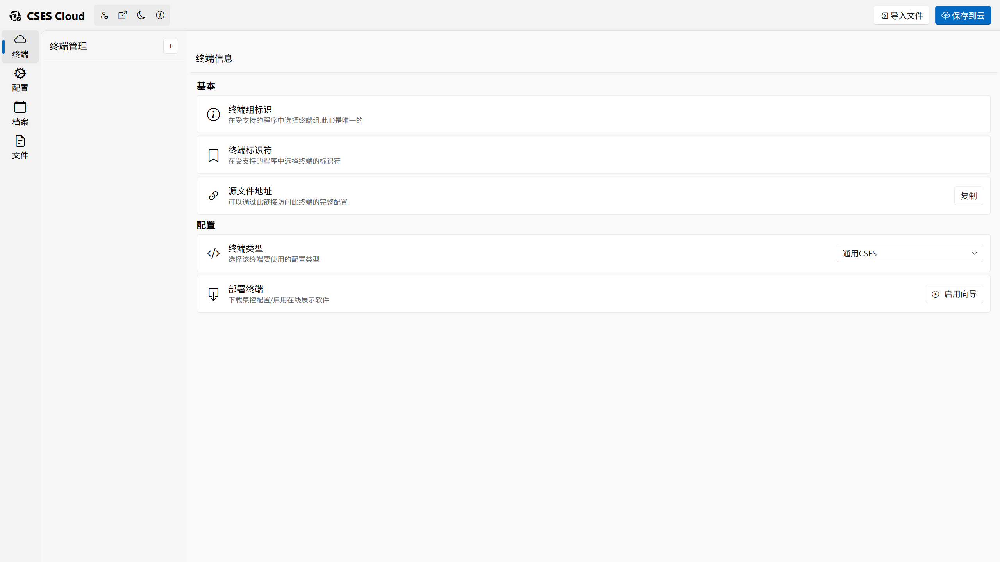
  - [ClassIsland/ClassIsland](https://github.com/ClassIsland/ClassIsland)  
    
  - [Class-Widgets/Class-Widgets](https://github.com/Class-Widgets/Class-Widgets)  
    
  - [Yamikani-Flipped/LingYun-Class-Widgets](https://github.com/Yamikani-Flipped/LingYun-Class-Widgets) 
    
  - [EnderWolf006/ElectronClassSchedule](https://github.com/EnderWolf006/ElectronClassSchedule) 
    
  - [GPUawa/iClass](https://github.com/GPUawa/iClass) 
    

- 多功能类
  - [STBBRD/ZongziTEK-Blackboard-Sticker](https://github.com/STBBRD/ZongziTEK-Blackboard-Sticker) 
    
  - [Ris-Soft/Ris_ClassTool](https://github.com/Ris-Soft/Ris_ClassTool) 
    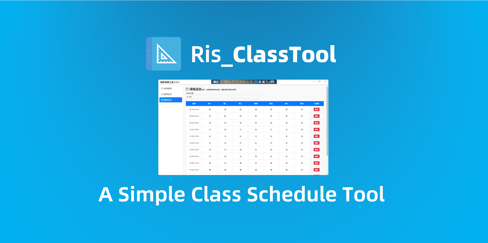
  - [OrbiBoard/OrbiBoard](https://github.com/OrbiBoard/OrbiBoard) 
    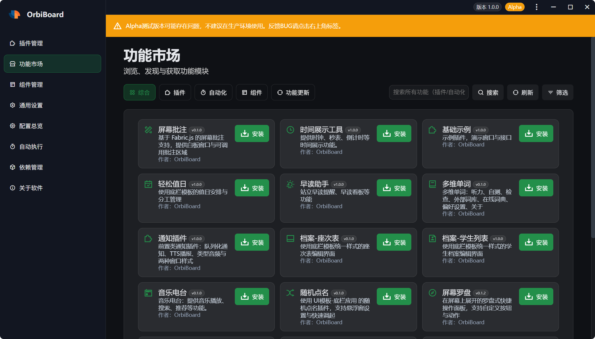
  - [Return-Log/Education-Clock](https://github.com/Return-Log/Education-Clock) 
    
  - [laoshuikaixue/VoiceHub](https://github.com/laoshuikaixue/VoiceHub) 
    

- 看板类
  - [ExamAware/ExamAware2](https://github.com/ExamAware/ExamAware2)  
    
  - [ExamAware/ExamShowboard-Legacy](https://github.com/ExamAware/ExamShowboard-Legacy) 
    
  - [ExamAware/ExamSchedule](https://github.com/ExamAware/ExamSchedule) 
    
  - [StickyHomeworks2/StickyHomeworks2](https://github.com/StickyHomeworks2/StickyHomeworks2)  
    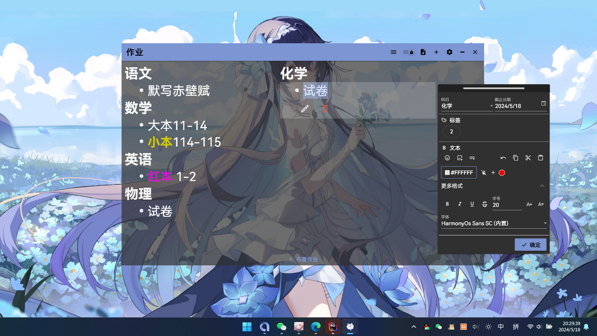
  - [Xwei1645/zooni](https://github.com/Xwei1645/zooni) 
    
  - [ZeroCatDev/Classworks](https://github.com/ZeroCatDev/Classworks)  
    
  - [EnderWolf006/HomeworkBoard](https://github.com/EnderWolf006/HomeworkBoard)  
    
  - [QQHKX/Immersive-clock](https://github.com/QQHKX/Immersive-clock) 
    
  - [Candlest/ClassBoard](https://github.com/Candlest/ClassBoard) 
    
  - [cjhdevact/LockTime](https://github.com/cjhdevact/LockTime) 
    
  - [xinghai-smartedu/classwindow](https://github.com/xinghai-smartedu/classwindow) 
    

- 批注类
  - [Alan-CRL/Inkeys](https://github.com/Alan-CRL/Inkeys)  
    
  - [WXRIW/Ink-Canvas](https://github.com/WXRIW/Ink-Canvas)  
    
  - [clover-yan/Ink-Canvas-Plus](https://github.com/clover-yan/Ink-Canvas-Plus) 
    
  - [WuChanging/Ink-Canvas](https://github.com/WuChanging/Ink-Canvas)  
    
  - [BaiYang2238/Ink-Canvas-Better](https://github.com/BaiYang2238/Ink-Canvas-Better) 
    
  - [InkCanvas/InkCanvasForClass](https://github.com/InkCanvas/InkCanvasForClass)  
    
  - [InkCanvasForClass/community](https://github.com/InkCanvasForClass/community) 
    
  - [Yunofactory/Kazuha](https://github.com/Yunofactory/Kazuha) 
    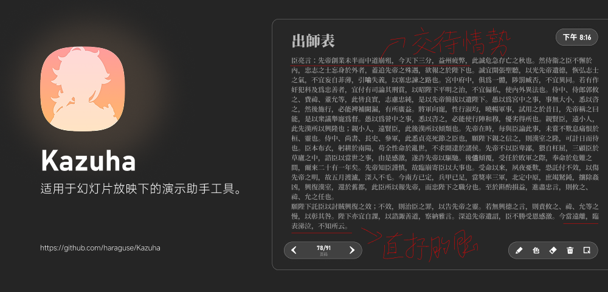
  - [lh11117/LemonxNote](https://github.com/lh11117/LemonxNote)  
    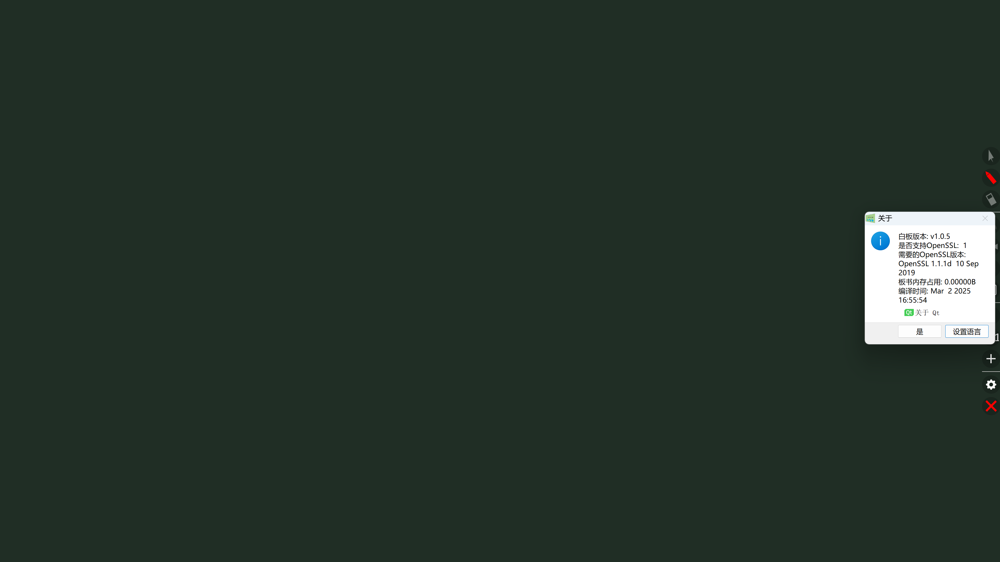
  - [wwiinnddyy/LanStartWrite](https://github.com/wwiinnddyy/LanStartWrite)  
    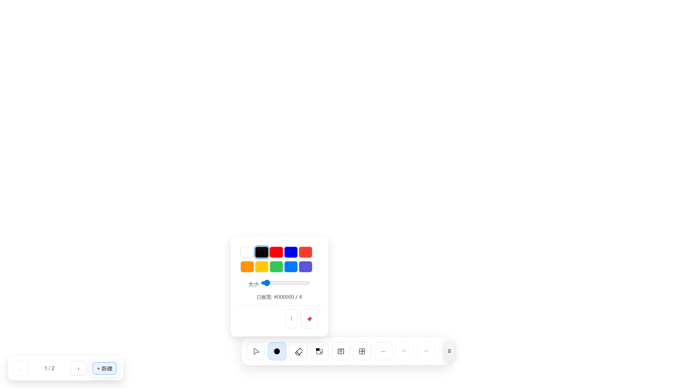

- 辅助类
  - [PANDAJSR/sidebar-for-class](https://github.com/PANDAJSR/sidebar-for-class)  
    
  - [jiugulixiaoniu/ClassScreenLock](https://github.com/jiugulixiaoniu/ClassScreenLock) 
    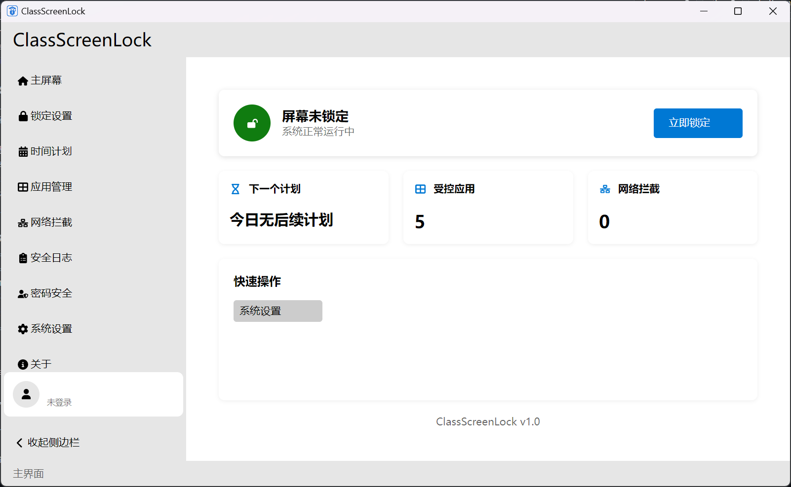

- 抽选类
  - [SECTL/SecRandom](https://github.com/SECTL/SecRandom)  
    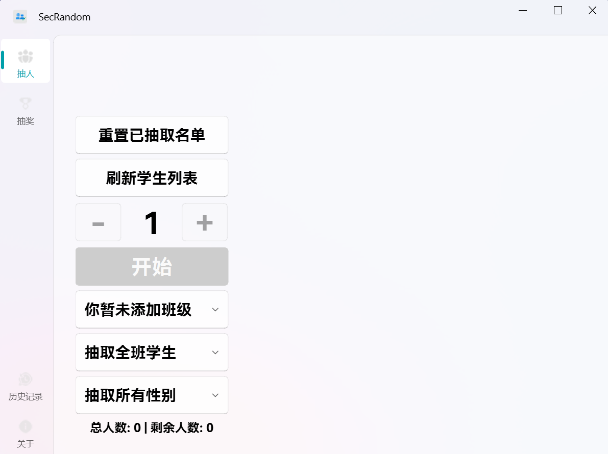
  - [NamePickerOrg/NamePicker](https://github.com/NamePickerOrg/NamePicker) 
    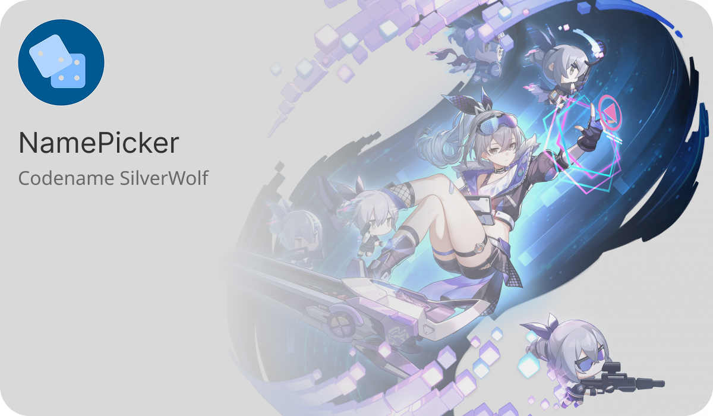
  - [LuoYunXi0407/Rand](https://github.com/LuoYunXi0407/Rand)  
    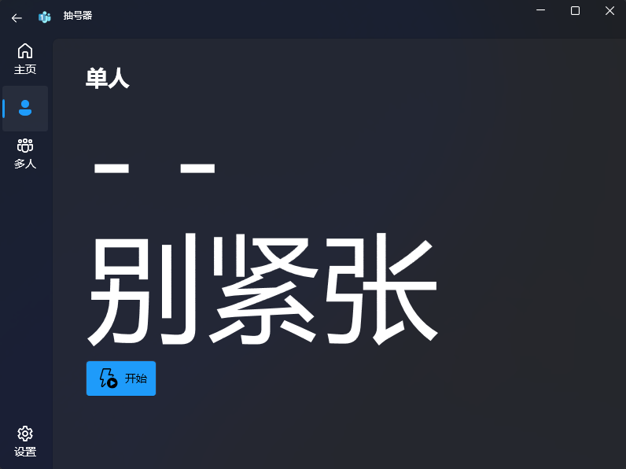
  - [typed-sigterm/ex-caller](https://github.com/typed-sigterm/ex-caller) 
    

## Star 历史

**如果这个项目对您有帮助，请点亮 Star** 🌟

## 💗 友情链接
- [智教联盟论坛](https://forum.smart-teach.cn/)
- [Awesome-Iwb](https://aiwb.dev.lipoly.ink/)
- [电教委员指南](https://smartteachcn.yuque.com/zpgkmv/cnel)
- [SEEWO GEEK](https://wiki.misaka.space/)
- [你缺失的那门计算机课](https://www.criwits.top/missing/)