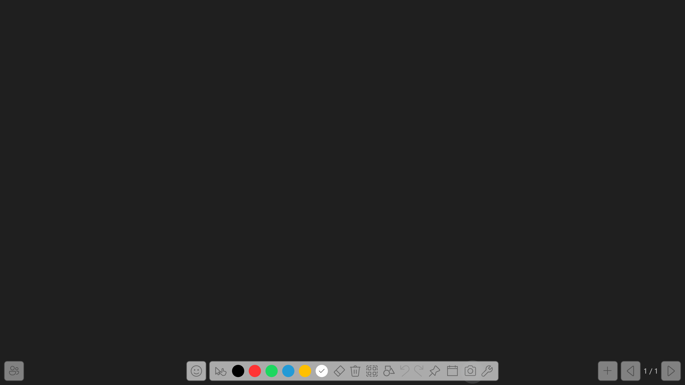
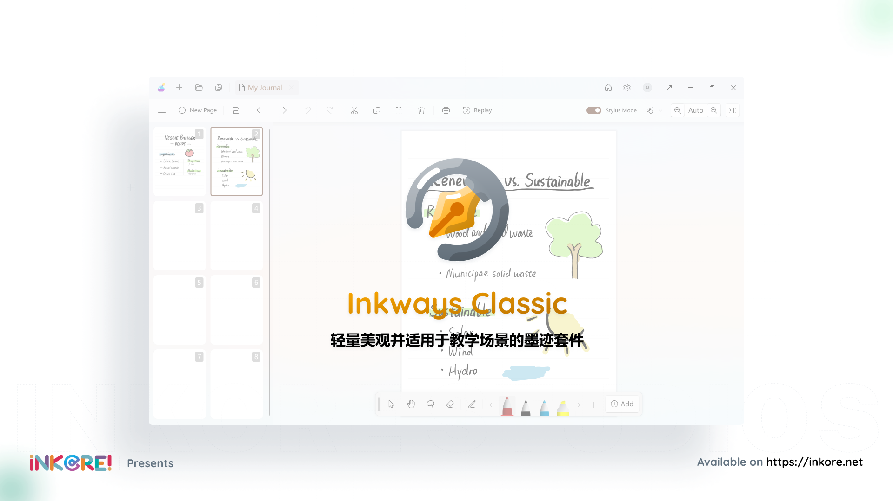
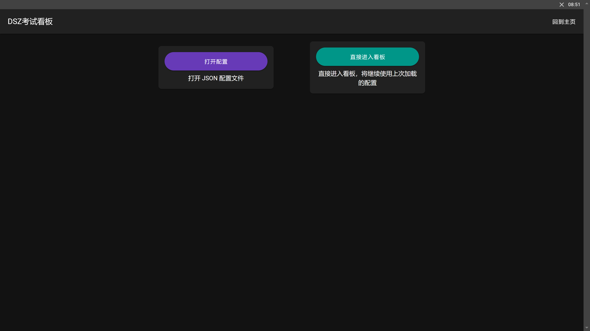
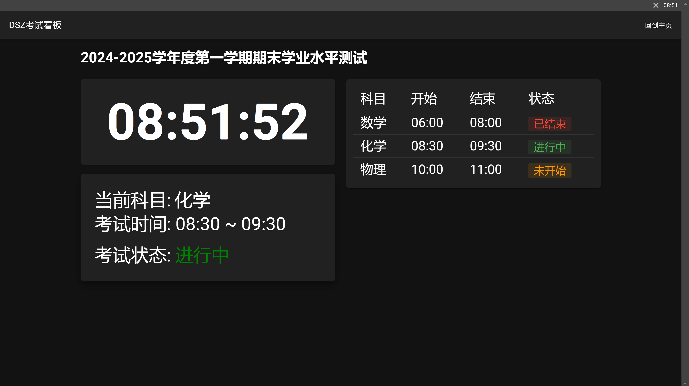

# Awesome Class Softwares 令人惊叹的班辅软件合集

## 目录

### [课表类](#课表类)

| 软件 | 开发者 |
| - | - |
| [ClassIsland](#classisland) |  [`ClassIsland`](https://github.com/ClassIsland) [`HelloWRC`](https://github.com/HelloWRC) |
| [ElectronClassSchedule](#electronclassschedule) | [`EnderWolf006`](https://github.com/EnderWolf006) |
| [Class-Widgets](#class-widgets) | [`RinLit-233-shiroko`](https://github.com/RinLit-233-shiroko) |

### [画板类](#画板类)

| 软件 | 开发者 |
| - | - |
| [Ink-Canvas](#ink-canvas) | [`WXRIW`](https://github.com/WXRIW) |
| [Ink Canvas Artistry](#ink-canvas-artistry) | [`InkCanvas`](https://github.com/InkCanvas) [`ChangSakura`](https://github.com/ChangSakura) |
| [InkCanvasForClass](#inkcanvasforclass) | [`InkCanvasForClass`](https://github.com/InkCanvasForClass) [`Doubx690i`](https://github.com/kriastans) |
| [智绘教Inkeys](#inkeys) | [`Alan-CRL`](https://github.com/Alan-CRL) |
| [Inkways Classic](#inkways-classic) | [`iNKORE Studios`](https://github.com/iNKORE-NET) |

### [桌面小工具与看板类](#桌面小工具与看板类)

| 软件 | 开发者 |
| - | - |
| [ZongziTEK-Blackboard-Sticker](#zongzitek-blackboard-sticker) | [`STBBRD`](https://github.com/STBBRD) |
| [HomeworkBoard](#homeworkboard) | [`EnderWolf006`](https://github.com/EnderWolf006) |
| [StickyHomeworks](#stickyhomeworks) | [`HelloWRC`](https://github.com/HelloWRC) |
| [DSZ考试看板](#dsz考试看板) | [`hello8693DSZ`](https://github.com/hello8693DSZ) |
| [ClassTools](#classtools) | [`clansty`](https://github.com/clansty) |

## 课表类

<image src="https://github.com/ClassIsland/ClassIsland/blob/master/ClassIsland/Assets/AppLogo_AppLogo.svg" height="48"/>

### ClassIsland

<!--  -->

 

 

ClassIsland 是一款适用于班级一体机的课程信息显示工具，支持显示当日课程等各种信息。

[ClassIsland 网站](https://classisland.tech/)｜[ClassIsland 文档](https://docs.classisland.tech/zh-cn/latest/)

GitHub仓库：[https://github.com/ClassIsland/ClassIsland](https://github.com/ClassIsland/ClassIsland) （更新状态：非常活跃）

#### 功能
- 当日课程显示
- 上、下课提醒，天气、预警提醒
- 档案管理（课表、时间表、科目）
  - 直观的编辑工具，从Excel或其他软件导入
  - 多周轮换，临时换课，临时启用课表
- 组件化设计，可自由组合显示内容
  - 日期、时间、课程表、天气简报、倒数日、自定义文本 
- 插件系统，可选扩展功能 ***（开发中）***
- 集控管理 ***（即将发布）***

<image src="https://github.com/EnderWolf006/ElectronClassSchedule/blob/main/image%2Ficon.png" height="48"/>

### ElectronClassSchedule

 

一款电子课程表软件

[使用说明](https://github.com/EnderWolf006/ElectronClassSchedule?tab=readme-ov-file#%E9%A3%9F%E7%94%A8%E8%AF%B4%E6%98%8E)

GitHub仓库：[https://github.com/EnderWolf006/ElectronClassSchedule](https://github.com/EnderWolf006/ElectronClassSchedule) （更新状态：较不活跃）

#### 功能
- 显示当天课程表、星期，倒数日
- 下课/上课倒计时
- 支持动态调整课表，支持多周(最多四周)课表轮换
- 窗口置顶，可点击穿透
- 编辑配置文件以编辑时间/课表

<image src="https://github.com/RinLit-233-shiroko/Class-Widgets/blob/main/img%2FLogo.png" height="48"/>

### Class Widgets

 

一款桌面课表软件

GitHub仓库：[https://github.com/RinLit-233-shiroko/Class-Widgets](https://github.com/RinLit-233-shiroko/Class-Widgets) （更新状态：活跃）

#### 功能
- 显示日期、时间，当前活动，接下来课程
- 方便的提醒系统
- 易用的课程表编辑界面
- 快捷调休/换课
- 同时存储多套课表

## 画板类

<image src="https://github.com/WXRIW/Ink-Canvas/blob/master/Ink%20Canvas%2FResources%2FInkCanvas.png" height="48"/>

### Ink Canvas

Ink Canvas 画板是一款轻量级画板软件，基于WPF/C#，其针对希沃一体机进行了特别优化，与预装的“希沃白板 5”软件相比，启动速度大幅度提升（提升5-10 倍），系统资源占用更小，使用体验更佳。

[使用指南](https://github.com/WXRIW/Ink-Canvas/blob/master/Manual.md/) | [常见问题](https://github.com/WXRIW/Ink-Canvas?tab=readme-ov-file#-faq)

  

GitHub仓库：[https://github.com/WXRIW/Ink-Canvas](https://github.com/WXRIW/Ink-Canvas) （更新状态：较不活跃）

#### 模式
- 幻灯片模式
- 画板模式（黑/白板模式）
- 屏幕画笔模式

#### 小工具
- 倒计时
  - 美观的 UI，并可以以接近全屏的大小显示
- 抽奖
  - 可导入名单（建议搭配 Excel 使用），可设置抽取人数
- 保存墨迹
  - 默认保存至 `文档\Ink Canvas Strokes`
- 截图
  - 任意模式模式下（包括鼠标）下点击相机图标截图并自动保存至 `图片\Ink Canvas Screenshots`，可在设置中开启“截图时自动保存墨迹”
- 幻灯片自动保存墨迹
  - 默认保存至 `文档\Ink Canvas Strokes`
- 墨迹回放
  - 从头自动书写一遍屏中墨迹

<image src="https://github.com/ChangSakura/Ink-Canvas/blob/master/Images/Ink%20Canvas%20Artistry.png" height="48"/>

### Ink Canvas Artistry

基于[Ink Canvas](https://github.com/WXRIW/Ink-Canvas)二次开发，优化了界面UI，是一款好用的屏幕批注/板书/PPT批注工具。

[常见问题](https://github.com/InkCanvas/Ink-Canvas-Artistry?tab=readme-ov-file#-faq)

GitHub仓库：[https://github.com/ChangSakura/Ink-Canvas](https://github.com/ChangSakura/Ink-Canvas) （更新状态：较不活跃）

<image src="https://github.com/InkCanvasForClass/InkCanvasForClass/blob/master/icc.png" height="48"/>

### InkCanvasForClass

InkCanvasForClass 是基于[ChangSakura](https://github.com/ChangSakura/)的 [Ink Canvas Artistry](https://github.com/InkCanvas/Ink-Canvas-Artistry)项目二次开发而来。该项目着重于优化原项目的 UI 设计，使其更便于课堂使用，同时也在积极开发新功能，修理原项目的不合理之处。

[爱发电](https://afdian.net/a/dubi906w/)｜[新网站](https://icc.bliemhax.com/)｜[常见问题](https://github.com/InkCanvasForClass/InkCanvasForClass?tab=readme-ov-file#faq)

GitHub仓库：[https://github.com/InkCanvasForClass/InkCanvasForClass](https://github.com/InkCanvasForClass/InkCanvasForClass) （更新状态：非常活跃）

Gitea仓库：[https://gitea.bliemhax.com/kriastans/InkCanvasForClass](https://gitea.bliemhax.com/kriastans/InkCanvasForClass) （更新状态：非常活跃）

> [!important]
> **此项目仍在开发中，只会在发布正式发行版时提供Release**
> 
> **[QQ 群](https://qm.qq.com/q/ptrGkAcqMo)内有 ICC 比较稳定的版本，可在群文件中获取**

#### 基础功能
- 屏幕批注
- PPT批注
- 白板模式

#### 优化和改进
- 浮动工具栏 UI 改进（正在开发）
- 白板模式 UI 改进（背景色和稿纸模式）
- **鼠标手势** 让画布移动、缩放、旋转变得更加轻松（正在开发）
- **全新的设置 UI** （正在开发）
- **强制置顶** 基于 UIAccess + 输入线程抢夺的方法，保证 ICC 永远显示在所有软件的最顶层
- **分辨率和DPI变化监听** 保证 ICC 界面正常显示
- **高性能透明** 绘制使用多线程 UI + WindowChrome，摆脱低性能体验
- **画面冻结** 使当前画面定格
- **重写形状绘制** 让绘图体验更舒适方便，并支持函数绘制和物理图绘制
- **PPT COM+VSTO双接口融合** 缓解 Office 和 WPS 共存导致的 COM 接口被占用的问题
- **PPT 系统优化** 高效 PPT 放映状态检测，不丢页不跳页
- **禁用边缘手势** 禁用烦人的 Windows10/11 的边缘触摸手势
- **点名器优化** 将支持历史记录和多名单抽选，同时支持特殊配置
- **内置小工具** 内置计算器，倒计时，秒表，放大镜，截图，英汉词典等实用小工具
- **QuickPanel**，方便快捷的从 ICC 打开所有应用和调整系统设置
- **情境化配置** 每位老师都有专属的配置文件
- **插件和脚本系统** 支持使用 dotNet Framework 开发原生扩展或使用 Javascript 开发脚本来实现自动化操作或其他扩充功能
- **形状识别** 基于微软库的手绘形状自动识别，并提供形状绘制纠正功能
- **板书库** 高效管理所有板书，课程自动分类，提供云端同步
- **自动收纳** 检测到教学软件自动开启时会自动隐藏 ICC 界面到屏幕侧边
- **自动查杀** 检测到指定软件可以让 ICC 查杀并自动使用 ICC 进行替代
- **桌面悬浮窗屏蔽** 隐藏画板悬浮窗
……

<image src="https://github.com/Alan-CRL/Inkeys/blob/main/GithubRes/logo.png" height="48"/>

### Inkeys

原名 Intelligent-Drawing-Teaching（简称 IDT），Windows 屏幕批注工具，拥有批注高效和功能丰富等特点，适用于触摸设备和PC端。

***让屏幕演示变得简单，让教学授课变得高效！***

官方网站：[https://www.inkeys.top/](https://www.inkeys.top/)

GitHub仓库：[https://github.com/Alan-CRL/Inkeys](https://github.com/Alan-CRL/Inkeys) （更新状态：暂时停更）

***(由于开发者本人原因，即日起至 2024.11 智绘教将临时停止更新)***

#### 功能

- 动态画板背景、窗口定格与穿透
- 智能绘图模块
  - 智能直线绘制/直线吸附/矩形吸附/平滑笔迹/智能粗细橡皮擦
- 炫彩全 RGBA 绘图，1-500 粗细调节
- 全新 UI 与可打断动画
- PPT 联动
  - 翻页/笔迹保留/插件
- 标准笔迹/荧光笔迹
- 撤回和历史画板恢复
- 画板绘制内容自动保存本地
- 随机点名插件
- 支持多指绘制以及模拟笔锋(均未完善)
- 可根据电脑环境自动选择 `RTS 触控库`或`鼠标位置 `作为绘制输入

#### 未来目标功能
- 快捷键
- 实时手抖修正（-> 模拟笔锋 -> 模拟压感 -> 笔触压感）
- UI 3.0
  - 全新操作逻辑、界面以及更多的自定义功能，界面缩放与自定义按键
- 全屏白、黑板
- 激光笔
- 自定皮肤模块
- 插件模块（暂定计时器和随机点名）
- 贴图镜
- 历史画板恢复
- 图层

<image src="Screenshots/Inkways/Inkways_256.png" height="48"/>

### Inkways Classic

**你最好的墨迹书写伙伴**

一个现代化，简洁而强大的，拥有智能书写算法优化的书写软件

- [X] 笔记本
- [X] 白板
- [X] PPT助手

强大的墨迹分析和优化算法

官方网站：[https://inkore.net/zh-cn/products/inkways/](https://inkore.net/zh-cn/products/inkways/)

GitHub仓库：[https://github.com/iNKORE-NET/Inkways](https://github.com/iNKORE-NET/Inkways)

## 桌面小工具与看板类

<image src="https://github.com/STBBRD/ZongziTEK-Blackboard-Sticker/blob/master/ZongziTEK_Blackboard_Sticker%2F%E9%BB%91%E6%9D%BF%E8%B4%B4.png" height="48"/>

### ZongziTEK-Blackboard-Sticker

 

用于一体机的桌面部件

GitHub仓库：[https://github.com/STBBRD/ZongziTEK-Blackboard-Sticker](https://github.com/STBBRD/ZongziTEK-Blackboard-Sticker) （更新状态：较不活跃）

官方网站：[https://zztek.top/](https://zztek.top/)

#### 功能
- 小黑板
  - 计算笔锋
  - 墨迹自动保存，打开时自动读取
  - 保存的墨迹文件可以使用 WXRIW 的 Ink Canvas 画板打开
  - 可以锁定，防止误触
- 启动台
  - 快捷启动台，可以自行编辑里面的项目
- 课程表
  - 自动切换显示每天课程
  - 上课前，提醒即将开始的课程名称及时间；下课时，提醒下一节课的名称及时间
  - 带有课程表编辑器
  - 以 json 格式存储
- 信息看板
  - 顶端显示：多个页面轮播，可自行选择
  - 日期页面
  - 倒数日页面
  - 实况天气页面：显示当前天气及气温
  - 天气预报页面：显示未来哪几天会下雨

<image src="https://github.com/EnderWolf006/HomeworkBoard/blob/main/ClientProject/public/vite.svg" height="48"/>

### HomeworkBoard

支持云同步的作业展示板

[使用说明](https://github.com/EnderWolf006/HomeworkBoard?tab=readme-ov-file#%E9%A3%9F%E7%94%A8%E8%AF%B4%E6%98%8E)

GitHub仓库：[https://github.com/EnderWolf006/HomeworkBoard](https://github.com/EnderWolf006/HomeworkBoard) （更新状态：较不活跃）

#### 功能
- 学校作业板：`SchoolProject-release.zip`
  - 在班级内快捷输入并排版清晰地展示作业
  - 快捷记录并展示出勤情况(可选板块)
  - 在浏览器中运行，可以进行云同步
  - 关闭后打开自动恢复之前记录的作业（自动拉取以当天时间为文件名的`json`文件的内容）
  - 支持自定义科目排版顺序、学生列表
- 查作业界面：`ClientProject-release.zip`
  - 在任何设备的浏览器中运行(需部署在服务器上并通过ip或域名访问)
  - 可以方便查询当前作业以及历史作业
  - 可以查询出勤情况(可选板块)
- API服务端：`APIServer-release.py`
  - 在任何支持运行Python的服务器运行
  - 若部署在公网服务器，请放行17312端口
  - 若部署在学校内网，则上述内容均只能在学校内网访问

<image src="https://github.com/HelloWRC/StickyHomeworks/blob/master/StickyHomeworks/Assets/AppLogo.png" height="48"/>

### StickyHomeworks

> 背景图片来自[Pixiv@辰暮sora](https://www.pixiv.net/artworks/110847880)

StickyHomeworks 是一款支持富文本的桌面作业贴工具。

GitHub仓库：[https://github.com/HelloWRC/StickyHomeworks](https://github.com/HelloWRC/StickyHomeworks) （更新状态：早期开发中）

> [!important]
> **这个项目还在早期开发中**
> 
> **需要体验的可以在[QQ群｜ClassIsland](https://qm.qq.com/q/xNnPEuI8GQ)群文件中获取，文件来自@Plaxz.Fnardn编译。**

#### 功能
- [X] 登记与修改作业
- [X] 富文本支持
- [X] 按科目分组作业
- [X] 为作业添加标签
- [X] 主界面全局缩放
- [X] 自动清理过期作业
- [X] 导出作业截图
- [ ] 作业历史记录
- [ ] 插入与管理表情包
- [ ] 插入图片
- [ ] 插入链接

<image src="https://github.com/hello8693DSZ/dsz-exam-showboard/blob/master/resources/icon.png" height="48"/>

### DSZ考试看板

一款显示当前时间与考试详细信息的看板类软件。

下载 [Realeases](https://github.com/hello8693DSZ/dsz-exam-showboard/releases) | [Actions](https://github.com/hello8693DSZ/dsz-exam-showboard/actions)

GitHub仓库：[https://github.com/hello8693DSZ/dsz-exam-showboard](
https://github.com/hello8693DSZ/dsz-exam-showboard) （更新状态：早期开发中）

> [!warning]
> **此项目仍在早期开发中，暂未提供正式发行版。**
> 
> **使用过程中可能会遇到一些未知的问题！**

#### 功能
- [X] 起始页展示`打开配置`、`直接进入看板`按钮
- [X] 上方展示`考试标题`
- [X] 左侧展示`当前时间`、`考试科目`、`开始/结束时间`、`考试状态`
- [X] 右侧展示考试科目列表，包括`科目`、`开始`、`结束`、`状态`
- [X] 考试结束前15分钟黄字提醒
- [ ] 后续将支持集控

<image src="icons/ClassTools.png" height="48"/>

### ClassTools

该软件可以动态壁纸的方式呈现高考倒计时、作业、课程表、值日生等内容，并提供简单易用的设置界面。

  

GitHub仓库：[https://github.com/clansty/ClassTools](https://github.com/clansty/ClassTools) （更新状态：长时间未更新）

#### 功能

- 时钟显示
- 高考倒计时
- 实时天气
- 作业布置
- 独立作业看板
- 标语展示
- 值日生设置
- 课程表展示

## Stars 历史

如果这个项目对您有帮助，请点亮 Star ⭐

