

# Awesome Class Softwares
# 适用äºç­çº§ä¸€ä½“机的优质软件åˆé›†

<a href="./CONTRIBUTING.md">
    <picture>
      <source media="(prefers-color-scheme: dark)" srcset="./icons/fa/code-pull-request-solid-light.svg">
      
    </picture>
</a>&nbsp;
<a href="#star-å†å²">
    <picture>
      <source media="(prefers-color-scheme: dark)" srcset="./icons/fa/star-solid-light.svg">
      
    </picture>
</a>&nbsp;
<a href="./links.md">
    <picture>
      <source media="(prefers-color-scheme: dark)" srcset="./icons/fa/link-solid-light.svg">
      
    </picture>
</a>&nbsp;
<picture>
    <source media="(prefers-color-scheme: dark)" srcset="./icons/fa/separator-light.svg">
    
</picture>&nbsp;
<a href="#课表类">
    <picture>
      <source media="(prefers-color-scheme: dark)" srcset="./icons/fa/calendar-days-solid-light.svg">
      
    </picture>
</a>&nbsp;
<a href="#多功能类">
    <picture>
      <source media="(prefers-color-scheme: dark)" srcset="./icons/fa/puzzle-piece-solid-light.svg">
      
    </picture>
</a>&nbsp;
<a href="#看æ¿ç±»">
    <picture>
      <source media="(prefers-color-scheme: dark)" srcset="./icons/fa/chalkboard-solid-light.svg">
      
    </picture>
</a>&nbsp;
<a href="#批注类">
    <picture>
      <source media="(prefers-color-scheme: dark)" srcset="./icons/fa/pen-solid-light.svg">
      
    </picture>
</a>&nbsp;
<a href="#下载类">
    <picture>
      <source media="(prefers-color-scheme: dark)" srcset="./icons/fa/download-solid-light.svg">
      
    </picture>
</a>&nbsp;
<a href="#éšæœºæŠ½é€‰">
    <picture>
      <source media="(prefers-color-scheme: dark)" srcset="./icons/fa/cubes-solid-light.svg">
      
    </picture>
</a>

> [!important]
> **本文档旨在æ¨è以下优质软件，如欲æ出问题，请å‰å¾€å¯¹åº”仓库/交æµå¹³å°**🔗
>
> **对äºè½¯ä»¶è¯¦ç»†ä»‹ç»ä¸ä½¿ç”¨æ–¹æ³•ï¼Œè¯·ç‚¹å‡»å¯¹åº” Web 页é¢é“¾æ¥è·³è½¬åˆ°ç½‘站相关页é¢**🔗
>
> **本文档仅供å‚考，信æ¯å¯èƒ½ä¼šæ›´æ–°ä¸åŠæ—¶ï¼Œè¯·å‰å¾€å¯¹åº”仓库查看最新动æ€**

> [!warning]
> **以下软件å‡ä¸ºå…费，如é‡æ”¶è´¹æ示请注æ„甄别ï¼**

> [!tip]
> **你知é“å—？**
> 
> **以下项目开å‘者基本都是学生**🤓
> 
> **以下徽章大部分点击åå¯è·³è½¬åˆ°å¯¹åº”链æ¥**🔗

> **👋åŒç±»é¡¹ç›®**

## 📃目录

### 🗓ï¸[课表类](#课表类)

| 软件 | 组织/主开å‘者 |
| - | - |
|  [CsesWebEditor](#cseswebeditor) |   [`SmartTeachCN`](https://github.com/SmartTeachCN)  [`PYLXU`](https://github.com/PYLXU) |
|  [ClassIsland](#classisland) |   [`ClassIsland`](https://github.com/ClassIsland)  [`HelloWRC`](https://github.com/HelloWRC) |
|  [Class-Widgets](#class-widgets) |  [`Class-Widgets`](https://github.com/Class-Widgets)  [`RinLit-233-shiroko`](https://github.com/RinLit-233-shiroko) |
|  [LingYun-Class-Widgets](#lingyun-class-widgets) |  [`Yamikani-Flipped`](https://github.com/Yamikani-Flipped) |
| 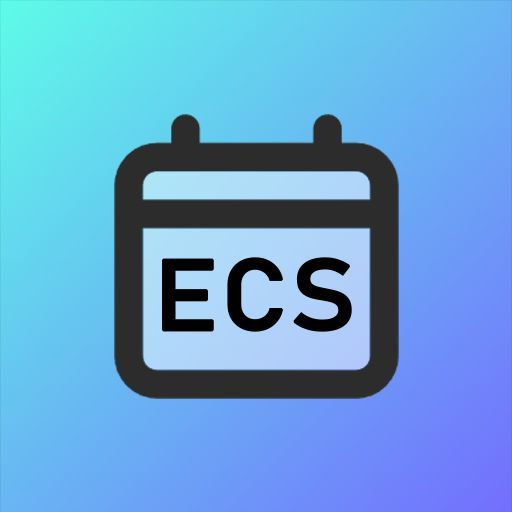 [ElectronClassSchedule](#electronclassschedule) |  [`EnderWolf006`](https://github.com/EnderWolf006) |
|  [iClass](#iclass) |  [`gpuawa`](https://github.com/gpuawa) |

### 🧩[多功能类](#多功能类)

| 软件 | 组织/主开å‘者 |
| - | - |
| 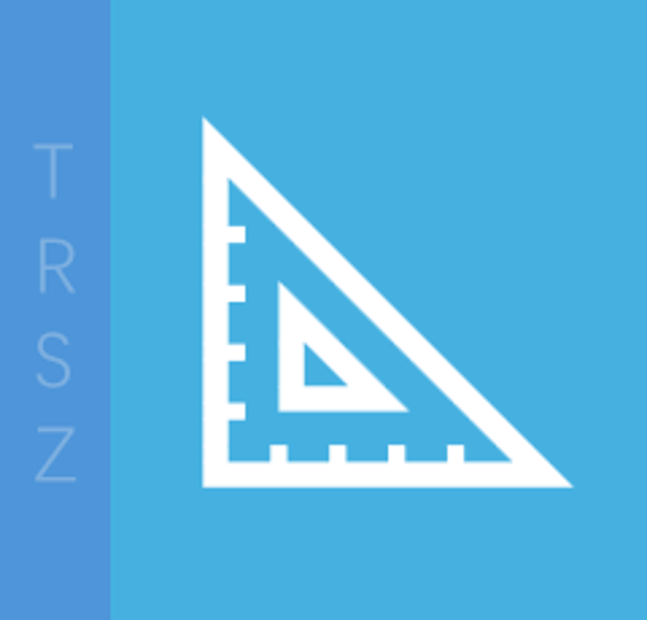 [Ris_ClassTool](#ris_classtool) |  [`Ris-Soft`](https://github.com/Ris-Soft)  [`PYLXU`](https://github.com/PYLXU) |
|  [ZongziTEK黑æ¿è´´](#zongzitek黑æ¿è´´) |  [`STBBRD`](https://github.com/STBBRD) |
| 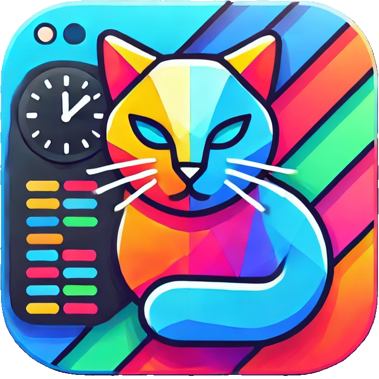 [Education Clock](#education-clock) |  [`Return-Log`](https://github.com/Return-Log) |

### 📊[看æ¿ç±»](#看æ¿ç±»)

| 软件 | 组织/主开å‘者 |
| - | - |
|  [ExamAware](#examaware) |  [`ExamAware`](https://github.com/ExamAware)  [`Hello8693`](https://github.com/Hello8693) |
|  [Sticky-attention](#sticky-attention) |  [`Sticky-attention`](https://github.com/Sticky-attention)  [`jizilin6732`](https://github.com/jizilin6732) |
|  [HomeworkBoard](#homeworkboard) |  [`EnderWolf006`](https://github.com/EnderWolf006) |
|  [Classworks](#classworks) |  [`ClassworksDev`](https://github.com/ClassworksDev)  [`SunWuyuan`](https://github.com/SunWuyuan) |
| 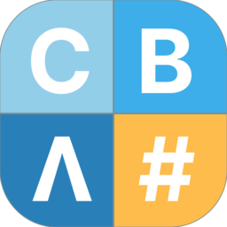 [ClassBoardSharp](#classboardsharp) |  [`Candlest`](https://github.com/Candlest) |
|  [LockTime](#locktime) |  [`cjhdevact`](https://github.com/cjhdevact) |

### ğŸ–ï¸[批注类](#批注类)

| 软件 | 组织/主开å‘者 |
| - | - |
|  [Ink-Canvas](#ink-canvas) |  [`WXRIW`](https://github.com/WXRIW) |
|  [Ink-Canvas-Plus](#ink-canvas-plus) |  [`clover-yan`](https://github.com/clover-yan/) |
|  [Ink-Canvas-Artistry](#ink-canvas-artistry) |  [`InkCanvas`](https://github.com/InkCanvas)  [`ChangSakura`](https://github.com/ChangSakura) |
|  [Ink-Canvas-Better](#ink-canvas-better) |  [`BaiYang2238`](https://github.com/BaiYang2238) |
| 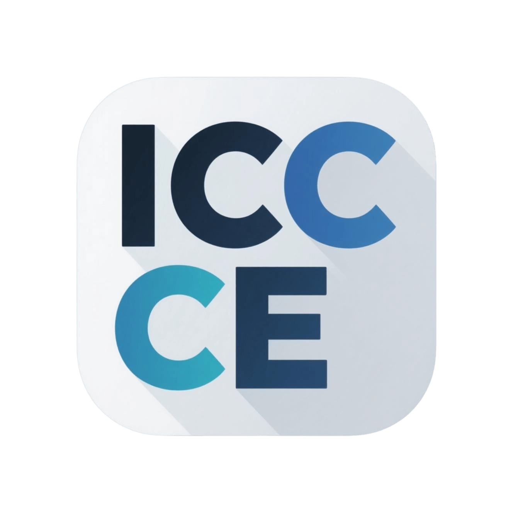 [ICC-CE](#icc-ce) |  [`InkCanvasForClass`](https://github.com/InkCanvasForClass)  [`CJKmkp`](https://github.com/CJKmkp) |
| 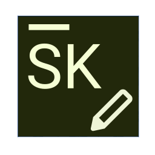 [SketchNow](#sketchnow) |  [`SketchNow`](https://github.com/SketchNow)  [`realybin`](https://github.com/realybin) |
|  [智绘教Inkeys](#智绘教inkeys) |  [`Alan-CRL`](https://github.com/Alan-CRL) |
|  [Inkways-Classic](#inkways-classic) |  [`iNKORE Studios`](https://github.com/iNKORE-NET) |
| 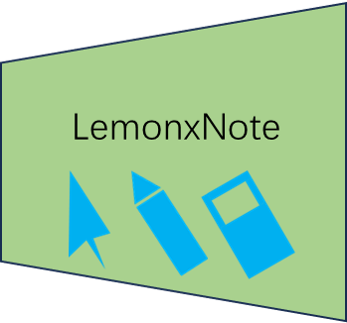 [LemonxNote](#lemonxnote) |  [`lh11117`](https://github.com/lh11117) |

### ⬇ï¸[下载类](#下载类)

| 软件 | 组织/主开å‘者 |
| - | - |
| 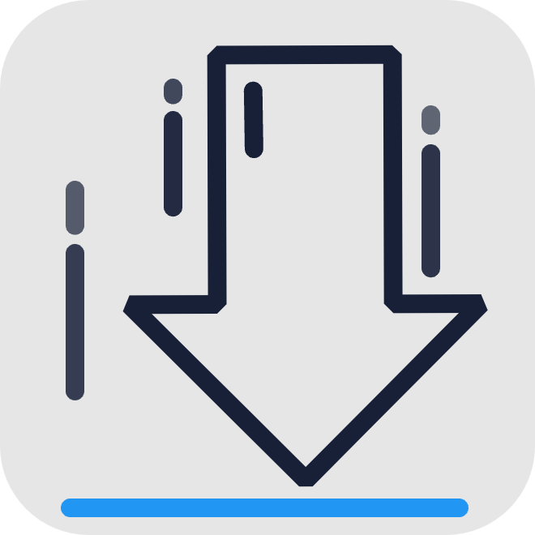 [SectionIstool](#SectionIstool) |  [`SectionIstool`](https://github.com/SectionIstool)  [`lzy98276`](https://github.com/lzy98276) |
| 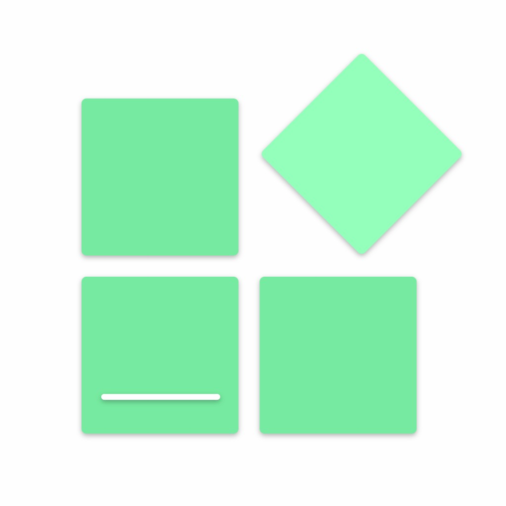 [SeewoHUB](#seewohub) |  [`CNwenwen`](https://github.com/CNwenwen) |

### ğŸ²[éšæœºæŠ½é€‰](#éšæœºæŠ½é€‰)

| 软件 | 组织/主开å‘者 |
| - | - |
|  [NamePicker](#namepicker) |  [`NamePicker`](https://github.com/NamePickerOrg)  [`LHGS-github`](https://github.com/LHGS-github) |
|  [Rand](#rand) |  [`LuoYunXi0407`](https://github.com/LuoYunXi0407) |
|  [SecRandom](#secrandom) |  [`lzy98276`](https://github.com/lzy98276) |
|  [ex-caller](#ex-caller) |  [`typed-sigterm`](https://github.com/typed-sigterm) |

## 课表类

### CsesWebEditor
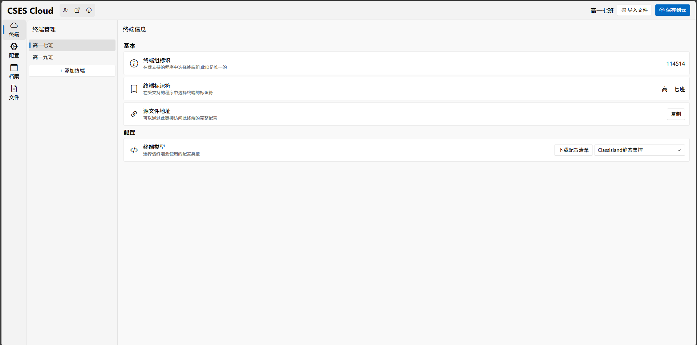

ä¸€ä¸ªåŸºäº Web çš„è¯¾ç¨‹è¡¨ç¼–è¾‘å™¨ï¼Œæ”¯æŒ CSES æ ¼å¼çš„课程表创建ã€ç®¡ç†å’Œå¯¼å‡ºï½œ[在线使用](https://edit.cses-org.cn/)

> 因网站备案，在线æœåŠ¡æš‚æ—¶åœæ­¢

|  **GitHub 仓库** |[https://github.com/SmartTeachCN/CsesWebEditor](https://github.com/SmartTeachCN/CsesWebEditor) |
|:-:|:-:|
| **Web 页é¢** | [./课表类/cses](https://nav.jursin.top/教辅软件/课表类/cses)

<image src="icons/ClassIsland.png" height="64">

### ClassIsland

一款适用äºç­çº§ä¸€ä½“机的课程信æ¯æ˜¾ç¤ºè½¯ä»¶ï¼Œæ”¯æŒæ˜¾ç¤ºå½“日课表ã€è¯¾ç¨‹ä¿¡æ¯ä¸å„`组件`ä¿¡æ¯ï¼Œå…·æœ‰ä¸°å¯Œçš„`æ’件系统`，支æŒå„ç§ç²¾ç»†åŒ–设置。

[ClassIsland 官网](https://classisland.tech/)｜[ClassIsland 文档](https://docs.classisland.tech)｜[ClassIsland 投票](https://github.com/ClassIsland/voting/discussions)

|  **GitHub 仓库** | [https://github.com/ClassIsland/ClassIsland](https://github.com/ClassIsland/ClassIsland) |
|:-:|:-:|
|  **`.NET 6`兼容版仓库** | [https://github.com/ClassIsland/ClassIsland-net6](https://github.com/ClassIsland/ClassIsland-net6)（å¯åœ¨`Windows 7`上正常è¿è¡Œï¼‰ |
|  **GitHub å‘行版** | [https://github.com/ClassIsland/ClassIsland/releases](https://github.com/ClassIsland/ClassIsland/releases) |
| **Web 页é¢** | [./课表类/classisland/](https://nav.jursin.top/教辅软件/课表类/classisland/)

<image src="icons/Class-Widgets.png" height="64">

### Class-Widgets

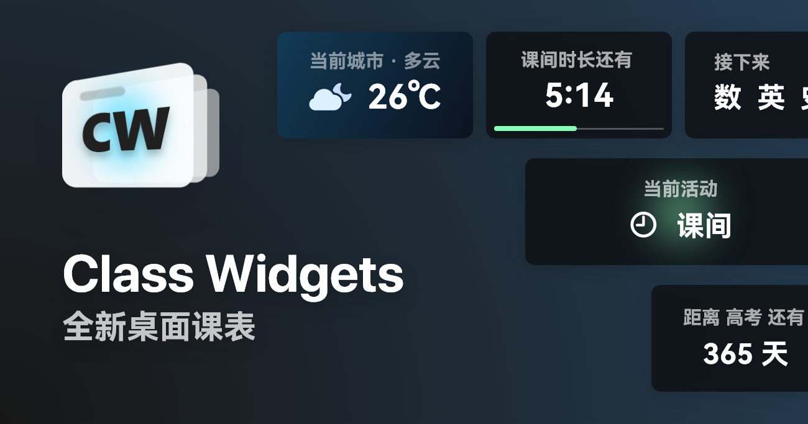

 

一款全新课表软件｜[Class-Widgets 官网](https://classwidgets.rinlit.cn/)｜[Class-Widgets 使用文档](https://www.yuque.com/rinlit/class-widgets_help)

|  **GitHub 仓库** | [https://github.com/Class-Widgets/Class-Widgets](https://github.com/Class-Widgets/Class-Widgets) |
|:-:|:-:|
|  **GitHub å‘行版** | [https://github.com/Class-Widgets/Class-Widgets/releases](https://github.com/Class-Widgets/Class-Widgets/releases) |
| **Web 页é¢** | [./课表类/class-widgets/](https://nav.jursin.top/教辅软件/课表类/class-widgets/)

<image src="icons/LingYun-Class-Widgets.png" height="64">

### LingYun-Class-Widgets

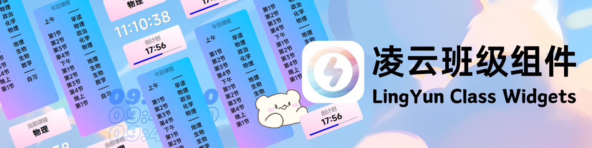

一款功能丰富的桌é¢å·¥å…·ï¼Œæ”¯æŒåœ¨æ¡Œé¢æ˜¾ç¤ºå„ç§ç»„ä»¶ï¼Œæ”¯æŒ CSES 通用课程表格å¼ï½œ[LingYun Class Widgets 官网](https://lingyun-6e2.pages.dev/)

|  **GitHub 仓库** | [https://github.com/Yamikani-Flipped/LingYun-Class-Widgets](https://github.com/Yamikani-Flipped/LingYun-Class-Widgets) |
|:-:|:-:|
|  **GitHub å‘行版** | [https://github.com/Yamikani-Flipped/LingYun-Class-Widgets/releases](https://github.com/Yamikani-Flipped/LingYun-Class-Widgets/releases) |
| **Web 页é¢** | [./课表类/lingyun-class-widgets](https://nav.jursin.top/教辅软件/课表类/lingyun-class-widgets/)

<image src="icons/ECS.png" height="64">

### ElectronClassSchedule

 

一款电å­è¯¾ç¨‹è¡¨è½¯ä»¶ï½œ[使用说æ˜](https://github.com/EnderWolf006/ElectronClassSchedule?tab=readme-ov-file#%E9%A3%9F%E7%94%A8%E8%AF%B4%E6%98%8E)

|  **GitHub 仓库** | [https://github.com/EnderWolf006/ElectronClassSchedule](https://github.com/EnderWolf006/ElectronClassSchedule) |
|:-:|:-:|
|  **GitHub å‘行版** | [https://github.com/EnderWolf006/ElectronClassSchedule/releases](https://github.com/EnderWolf006/ElectronClassSchedule/releases) |
| **Web 页é¢** | [./课表类/ElectronClassSchedule](https://nav.jursin.top/教辅软件/课表类/ElectronClassSchedule/) |

<image src="icons/iClass.png" width="64">

### iClass

 

 

åŸå **ESC++，iMagicTools** ，一个简å•çš„课表软件，使用 Electron 框æ¶

 |  **GitHub 仓库** | [https://github.com/gpuawa/iClass](https://github.com/gpuawa/iClass) |
 |:-:|:-:|
|  **GitHub å‘行版** | [https://github.com/gpuawa/iClass/releases](https://github.com/gpuawa/iClass/releases) |
| **Web 页é¢** | [./课表类/iclass](https://nav.jursin.top/教辅软件/课表类/iclass/) |

## 多功能类

<image src="icons/Ris_ClassTool.png" height="64">

### Ris_ClassTool

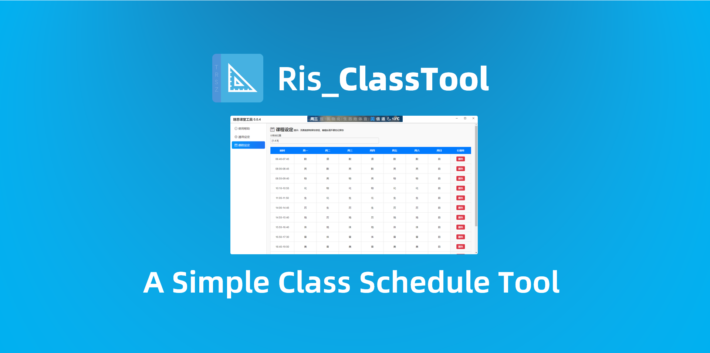

ç‘æ€è¯¾å ‚工具｜[Ris_ClassTool 下载站](https://app.3r60.top/Ris_ClassTool)

|  **GitHub 仓库** |[https://github.com/Ris-Soft/Ris_ClassTool](https://github.com/Ris-Soft/Ris_ClassTool) |
|:-:|:-:|
|  **GitHub å‘行版** | [https://github.com/Ris-Soft/Ris_ClassTool/releases](https://github.com/Ris-Soft/Ris_ClassTool/releases) |
| **Web 页é¢** | [./多功能类/ris_classtool](https://nav.jursin.top/教辅软件/多功能类/ris_classtool/) |

<image src="icons/ZongziTEK.png" height="64">

### ZongziTEK黑æ¿è´´

<picture>
  <source media="(prefers-color-scheme: dark)" srcset="https://i.postimg.cc/brKZqTgf/Dark.png">
  
</picture>

 

用äºç­çº§ä¸€ä½“机的桌é¢å°éƒ¨ä»¶ï½œ[ZongziTEK黑æ¿è´´å®˜ç½‘](https://zztek.top/)

|  **GitHub 仓库** | [https://github.com/STBBRD/ZongziTEK-Blackboard-Sticker](https://github.com/STBBRD/ZongziTEK-Blackboard-Sticker) |
|:-:|:-:|
|  **GitHub å‘行版** | [https://github.com/STBBRD/ZongziTEK-Blackboard-Sticker/releases](https://github.com/STBBRD/ZongziTEK-Blackboard-Sticker/releases) |
| **Web 页é¢** | [./多功能类/zongzitek-blackboard-sticker](https://nav.jursin.top/教辅软件/多功能类/zongzitek-blackboard-sticker/)

<image src="icons/Education-Clock.png" height="64">

### Education-Clock

一个å®ç”¨çš„ç­çº§ä¿¡æ¯çœ‹æ¿

|  **GitHub 仓库** | [https://github.com/Return-Log/Education-Clock](https://github.com/Return-Log/Education-Clock) |
|:-:|:-:|
|  **GitHub å‘行版** | [https://github.com/Return-Log/Education-Clock/releases](https://github.com/Return-Log/Education-Clock/releases) |
| **Web 页é¢** | [./多功能类/education-clock](https://nav.jursin.top/教辅软件/多功能类/education-clock)

## 看æ¿ç±»

### ExamAware

#### ExamShowboard-Legacy
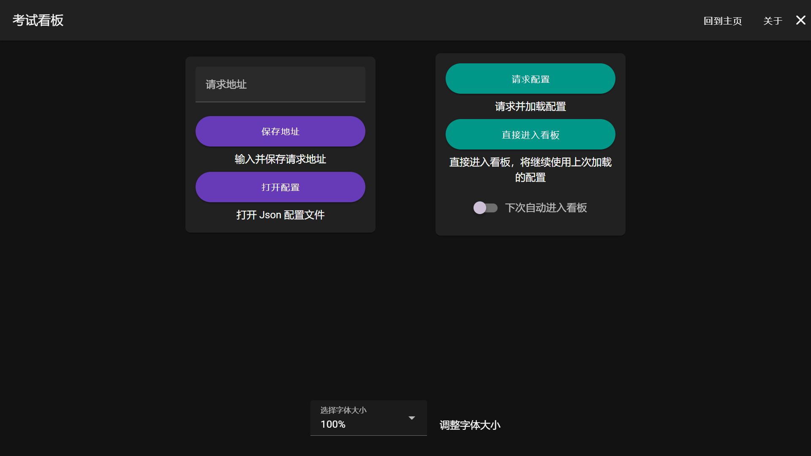

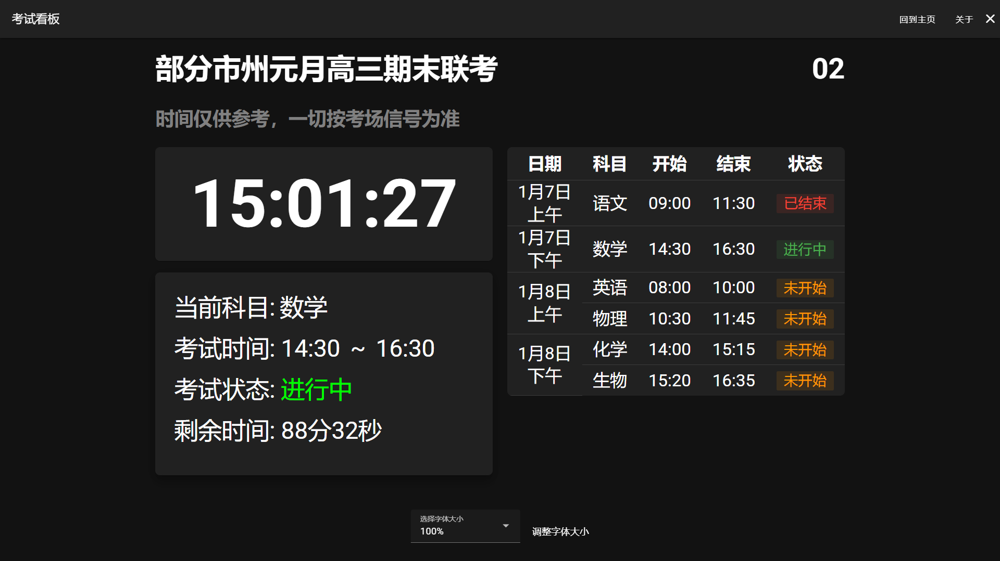

一款显示当å‰æ—¶é—´ä¸è€ƒè¯•è¯¦ç»†ä¿¡æ¯çš„显示工具｜[网页版在线体验](http://examboard.cn/)

|  **GitHub 仓库** | [https://github.com/ExamAware/ExamShowboard-Legacy](https://github.com/ExamAware/ExamShowboard-Legacy) |
|:-:|:-:|
|  **GitHub å‘行版** | [https://github.com/ExamAware/ExamShowboard-Legacy/releases](https://github.com/ExamAware/ExamShowboard-Legacy/releases) |
| **Web 页é¢** | [./看æ¿ç±»/examaware/exam-showboard](https://nav.jursin.top/教辅软件/看æ¿ç±»/examaware/exam-showboard)

#### ExamSchedule
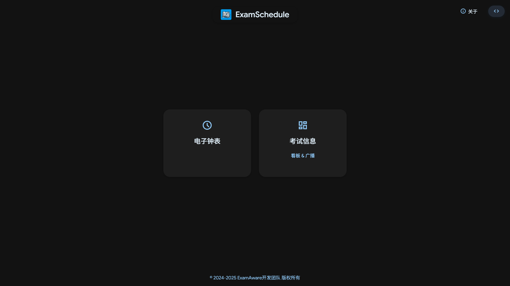
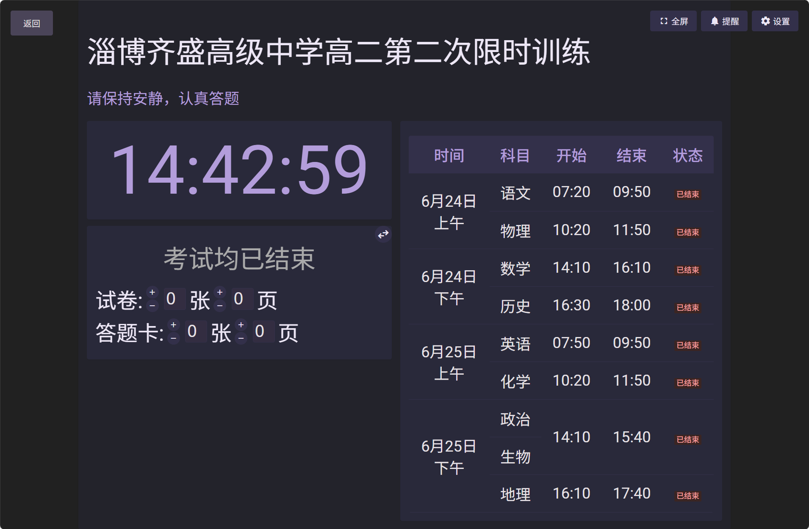

网页版考试看æ¿ï½œ[网页版在线体验](https://es.examaware.tech/)

|  **GitHub 仓库** | [https://github.com/ExamAware/ExamSchedule](https://github.com/ExamAware/ExamSchedule) |
|:-:|:-:|
|  **GitHub å‘行版** | [https://github.com/ExamAware/ExamSchedule/releases](https://github.com/ExamAware/ExamSchedule/releases) |
| **Web 页é¢** | [./看æ¿ç±»/examaware/examschedule](https://nav.jursin.top/教辅软件/看æ¿ç±»/examaware/examschedule)

<image src="icons/Sticky-attention.png" height="64">

### Sticky-attention

 

ä¸€æ¬¾é€‚ç”¨äº Windows 系统教室一体机的作业显示工具，å¯ä»¥å±•ç¤ºå„科作业

|  **GitHub 仓库** | [https://github.com/Sticky-attention/Sticky-attention](https://github.com/Sticky-attention/Sticky-attention) |
|:-:|:-:|
|  **GitHub å‘行版** | [https://github.com/Sticky-attention/Sticky-attention/releases](https://github.com/Sticky-attention/Sticky-attention/releases) |
| **Web 页é¢** | [./看æ¿ç±»/sticky-attention](https://nav.jursin.top/教辅软件/看æ¿ç±»/sticky-attention)

<image src="icons/vite.svg" height="64">

### HomeworkBoard

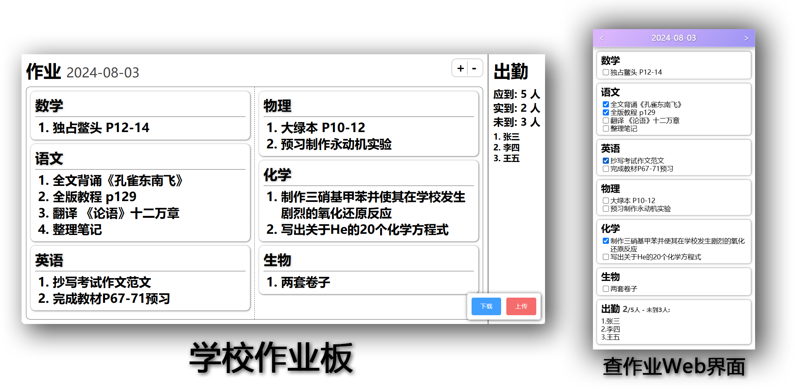

一款支æŒäº‘åŒæ­¥çš„作业展示æ¿è½¯ä»¶ï½œ[使用说æ˜](https://github.com/EnderWolf006/HomeworkBoard?tab=readme-ov-file#%E9%A3%9F%E7%94%A8%E8%AF%B4%E6%98%8E)

|  **GitHub 仓库** | [https://github.com/EnderWolf006/HomeworkBoard](https://github.com/EnderWolf006/HomeworkBoard) |
|:-:|:-:|
|  **GitHub å‘行版** | [https://github.com/EnderWolf006/HomeworkBoard/releases](https://github.com/EnderWolf006/HomeworkBoard/releases) |
| **Web 页é¢** | [./看æ¿ç±»/homeworkboard](https://nav.jursin.top/教辅软件/看æ¿ç±»/homeworkboard)

<image src="icons/Classworks.png" height="64">

### Classworks
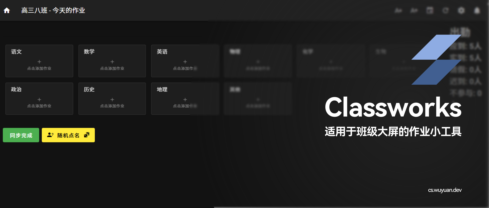

åŸºäº Vue 3 + Vuetify çš„ç°ä»£åŒ–作业管ç†ç³»ç»Ÿå‰ç«¯é¡¹ç›®ï½œ[ZeroCat 官网](https://zerocat.houlangs.com)

|  **GitHub 仓库** | [https://github.com/ClassworksDev/Classworks](https://github.com/ClassworksDev/Classworks) |
|:-:|:-:|
|  **GitHub å‘行版** | [https://github.com/ClassworksDev/Classworks/releases](https://github.com/ClassworksDev/Classworks/releases) |
| **Web 页é¢** | [./看æ¿ç±»/classworks](https://nav.jursin.top/教辅软件/看æ¿ç±»/classworks)

<image src="icons/ClassBoardSharp.png" height="64">

### ClassBoardSharp

一款高自由度的用äºæ˜¾ç¤ºæ•™å­¦ä¿¡æ¯çš„å£çº¸è½¯ä»¶

|  **GitHub 仓库** | [https://github.com/Candlest/ClassBoardSharp](https://github.com/Candlest/ClassBoardSharp) |
|:-:|:-:|
|  **GitHub å‘行版** | [https://github.com/Candlest/ClassBoardSharp/releases](https://github.com/Candlest/ClassBoardSharp/releases) |
| **Web 页é¢** | [./多功能类/classboardsharp](https://nav.jursin.top/教辅软件/多功能类/classboardsharp)

<image src="icons/LockTime.png" height="64">

### LockTime
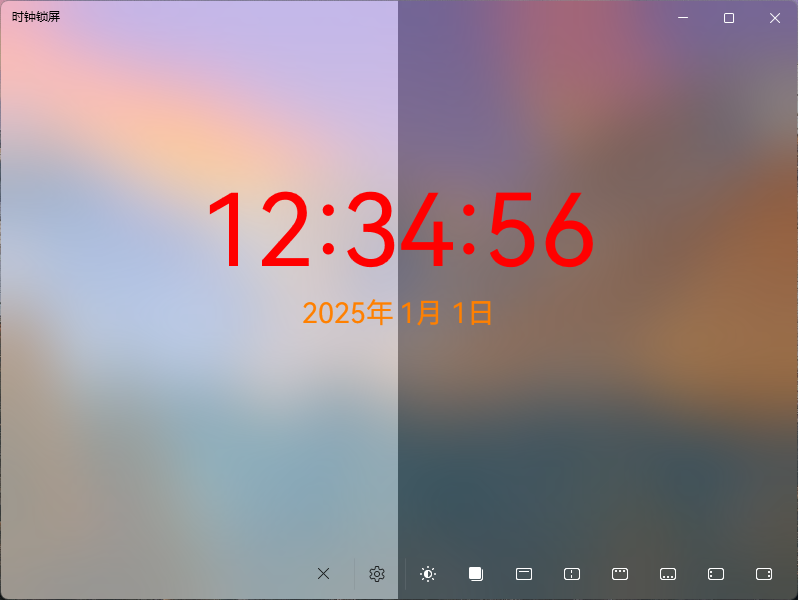

一个使用 Fluent UI 2 ç•Œé¢çš„时钟é”å±è½¯ä»¶

|  **GitHub 仓库** | [https://github.com/cjhdevact/LockTime](https://github.com/cjhdevact/LockTime) |
|:-:|:-:|
|  **GitHub å‘行版** | [https://github.com/cjhdevact/LockTime/releases](https://github.com/cjhdevact/LockTime/releases) |
| **Web 页é¢** | [./看æ¿ç±»/locktime](https://nav.jursin.top/教辅软件/看æ¿ç±»/locktime)

## 批注类

<image src="icons/Ink-Canvas.png" height="64">

### Ink-Canvas
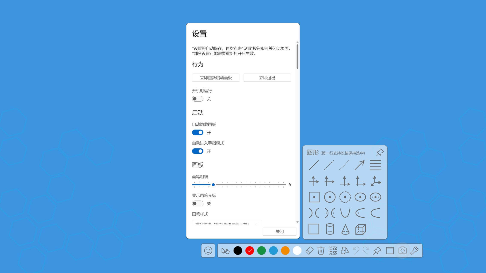
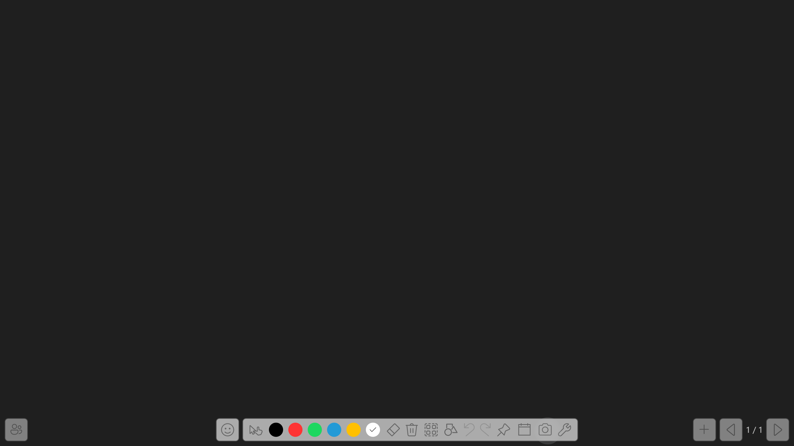

Ink Canvas ç”»æ¿æ˜¯ä¸€æ¬¾è½»é‡çº§ç”»æ¿è½¯ä»¶ï¼ŒåŸºäºWPF/C#，其针对希沃一体机进行了特别优化，ä¸é¢„è£…çš„â€œå¸Œæ²ƒç™½æ¿ 5â€è½¯ä»¶ç›¸æ¯”，å¯åŠ¨é€Ÿåº¦å¤§å¹…度æå‡ï¼ˆæå‡5-10 å€ï¼‰ï¼Œç³»ç»Ÿèµ„æºå ç”¨æ›´å°ï¼Œä½¿ç”¨ä½“验更佳。

[使用指å—](https://github.com/WXRIW/Ink-Canvas/blob/master/Manual.md/) | [常è§é—®é¢˜](https://github.com/WXRIW/Ink-Canvas?tab=readme-ov-file#-faq)

|  **GitHub 仓库** | [https://github.com/WXRIW/Ink-Canvas](https://github.com/WXRIW/Ink-Canvas) |
|:-:|:-:|
|  **GitHub å‘行版** | [https://github.com/WXRIW/Ink-Canvas/releases](https://github.com/WXRIW/Ink-Canvas/releases) |
| **Web 页é¢** | [./批注类/ink-canvas](https://nav.jursin.top/教辅软件/批注类/ink-canvas)

<image src="icons/Ink-Canvas-Plus.png" height="64">

### Ink-Canvas-Plus

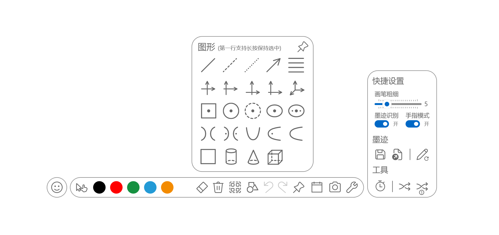

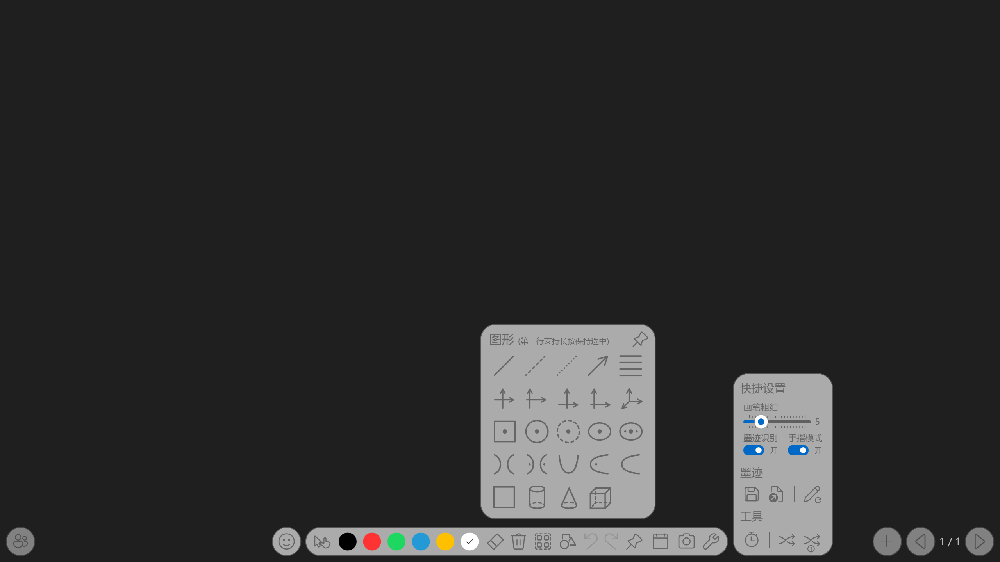]

![C#](https://img.shields.io/badge/C%23-blue?logo=)

Ink Canvas Plus (IC+) 是一款由 Clover Yan 维护ã€å¤åˆ»è‡ª [WXRIW/Ink Canvas](https://github.com/WXRIW/Ink-Canvas) çš„ Windows ç”»æ¿åº”用，旨在优化å„æ–¹é¢çš„使用体验，并尽å¯èƒ½ä¿ç•™åŸç‰ˆ Ink Canvas çš„æ“作体验。

[使用指å—](https://github.com/clover-yan/Ink-Canvas-Plus/blob/master/Manual.md/) | [常è§é—®é¢˜](https://github.com/clover-yan/Ink-Canvas-Plus?tab=readme-ov-file#-faq)｜[Ink-Canvas-Plus 官网](https://www.khyan.top/apps/Ink-Canvas-Plus/)

|  **GitHub 仓库** | [https://github.com/clover-yan/Ink-Canvas-Plus](https://github.com/clover-yan/Ink-Canvas-Plus) |
|:-:|:-:|
|  **GitHub å‘行版** | [https://github.com/clover-yan/Ink-Canvas-Plus/releases](https://github.com/clover-yan/Ink-Canvas-Plus/releases) |
| **Web 页é¢** | [./批注类/ink-canvas-plus](https://nav.jursin.top/教辅软件/批注类/ink-canvas-plus)

<image src="icons/Ink-Canvas-Artistry.png" height="64">

### Ink-Canvas-Artistry

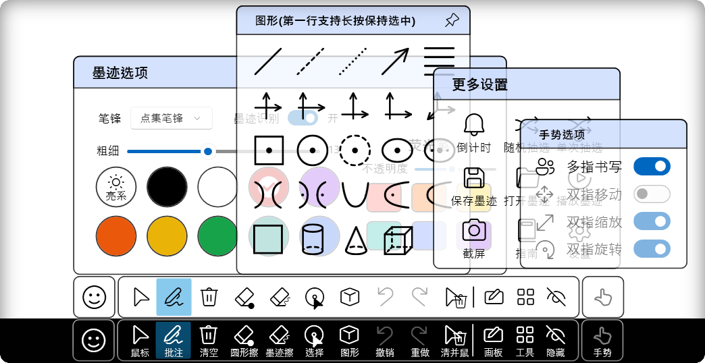
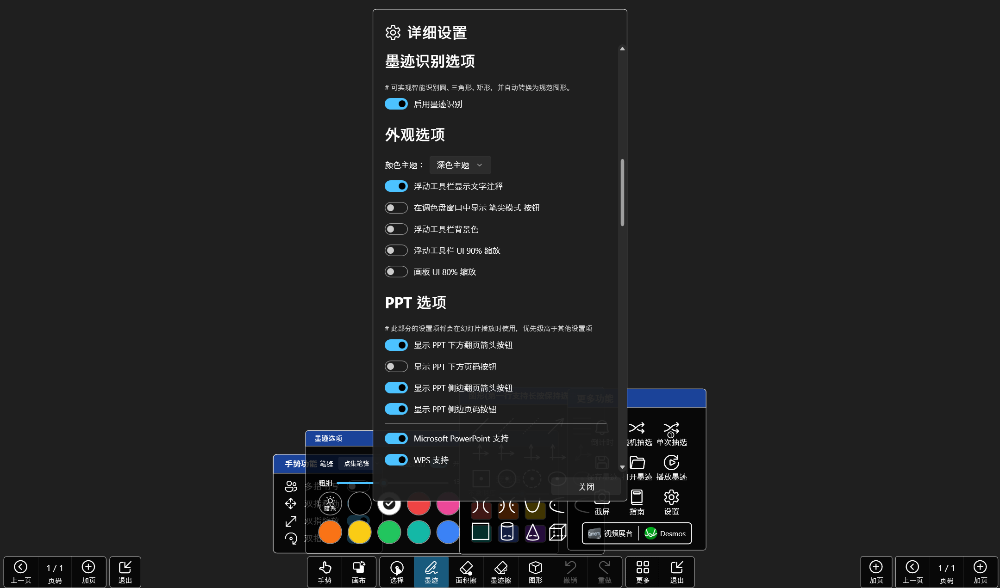

![C#](https://img.shields.io/badge/C%23-blue?logo=)

åŸºäº [Ink Canvas](https://github.com/WXRIW/Ink-Canvas) 二次开å‘，优化了界é¢UI，是一款好用的å±å¹•æ‰¹æ³¨/æ¿ä¹¦/PPT批注工具｜[常è§é—®é¢˜](https://github.com/InkCanvas/Ink-Canvas-Artistry?tab=readme-ov-file#-faq)

|  **GitHub 仓库** | [https://github.com/ChangSakura/Ink-Canvas](https://github.com/ChangSakura/Ink-Canvas) |
|:-:|:-:|
|  **GitHub å‘行版** | [https://github.com/ChangSakura/Ink-Canvas/releases](https://github.com/ChangSakura/Ink-Canvas/releases) |
| **Web 页é¢** | [./批注类/ink-canvas-artistry](https://nav.jursin.top/教辅软件/批注类/ink-canvas-artistry)

### Ink-Canvas-Better
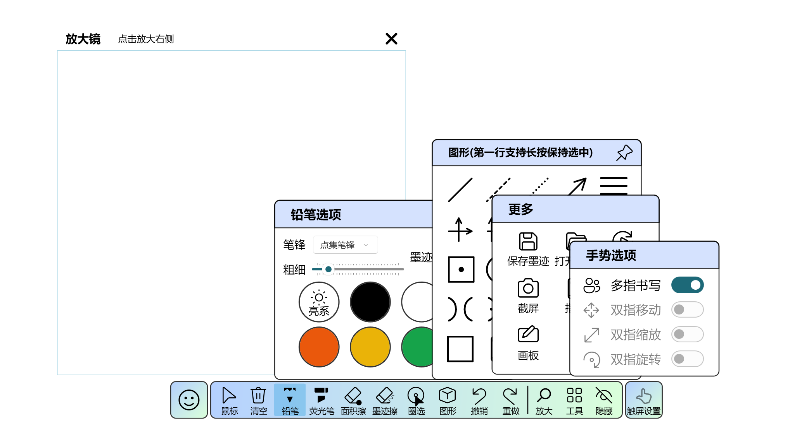

![C#](https://img.shields.io/badge/C%23-blue?logo=)

该软件在 [Ink-Canvas-Artistry](https://github.com/InkCanvas/Ink-Canvas-Artistry) 的基础上对 [Ink-Canvas](https://github.com/WXRIW/Ink-Canvas) 进行了二次修改，且**移除**了点å和计时器工具等éç”»æ¿è½¯ä»¶çš„核心功能  

[ç›´æ¥ä¸‹è½½](https://github.com/BaiYang2238/Ink-Canvas-Better/releases/latest)｜[使用说æ˜](https://github.com/BaiYang2238/Ink-Canvas-Better/blob/master/Document/Manual.md)｜[éšç§æ”¿ç­–](https://github.com/BaiYang2238/Ink-Canvas-Better/blob/master/Document/Privacy.md)

|  **GitHub 仓库** | [https://github.com/BaiYang2238/Ink-Canvas-Better](https://github.com/BaiYang2238/Ink-Canvas-Better) |
|:-:|:-:|
|  **GitHub å‘行版** | [https://github.com/BaiYang2238/Ink-Canvas-Better/releases](https://github.com/BaiYang2238/Ink-Canvas-Better/releases) |
| **Web 页é¢** | [./批注类/Ink-Canvas-Better](https://nav.jursin.top/教辅软件/批注类/Ink-Canvas-Better) |

### ICC-CE
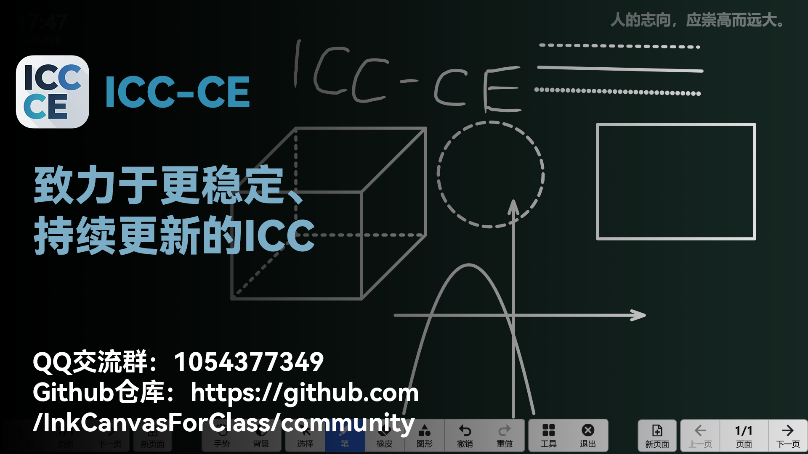

在 [`icc-20240610-stable`](https://github.com/Awesome-Iwb/icc-20240610-stable) 基础上二次开å‘的一个社区版本，目å‰ä»åœ¨ç§¯æ维护中

[官网](https://www.iccce.dpdns.org/)｜[文档站](https://inkcanvasforclass.github.io/website)｜[智教è”盟æ¿å—](https://forum.smart-teach.cn/t/icc-ce)

  
InkCanvasForClass

  

  

  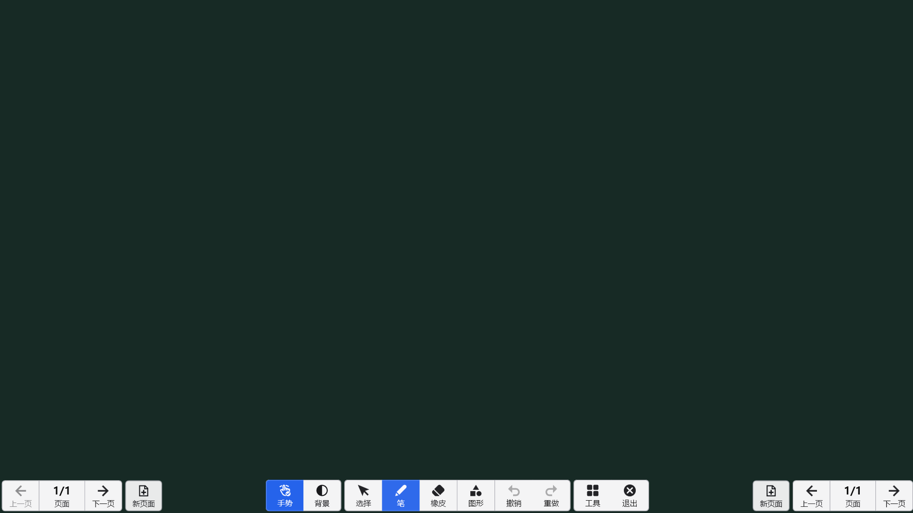

  
  
  
  
  
  
  ![C#](https://img.shields.io/badge/C%23-blue?logo=)
  

  ä¸€æ¬¾åŸºäº [Ink-Canvas-Artistry](https://github.com/ChangSakura/Ink-Canvas) çš„å¼€æºæ˜“用的电å­æ•™é­è½¯ä»¶ï¼Œä¸“为课堂教学场景优化设计

  

  > [!warning]
  > 二次开å‘仓库（å‡å·²å­˜æ¡£ï¼‰
  >
  > - [Ink-Canvas-reborn](https://github.com/Awesome-Iwb/Ink-Canvas-Reborn)
  >
  > - [icc-20240610-stable](https://github.com/Awesome-Iwb/icc-20240610-stable)
  >
  > - [icc-latest-20250607-unstable](https://github.com/Awesome-Iwb/icc-latest-20250607-unstable)

|  **GitHub 仓库** | [https://github.com/InkCanvas/InkCanvasForClass](https://github.com/InkCanvas/InkCanvasForClass)**（已存档）** |
|:-:|:-:|
|  **社区版 GitHub 仓库** | [https://github.com/InkCanvasForClass/community](https://github.com/InkCanvasForClass/community) |
|  **社区版 GitHub å‘行版** | [https://github.com/InkCanvasForClass/community/releases](https://github.com/InkCanvasForClass/community/releases) |
| **Web 页é¢** | [./批注类/inkcanvasforclass](https://nav.jursin.top/教辅软件/批注类/inkcanvasforclass) |

<image src="icons/SketchNow.png" height="64">

### SketchNow

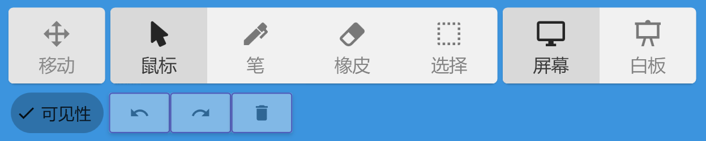

一款让您能在å±å¹•ä»»æ„ä½ç½®å®æ—¶ç»˜å›¾çš„应用程åºï½œ[Upcoming](https://github.com/orgs/SketchNow/projects)

> [!caution]
> 当å‰ä»åœ¨å¼€å‘阶段。为é¿å…潜在é£é™©ï¼Œè¯·å‹¿åœ¨ç”Ÿäº§ç¯å¢ƒä¸­å®‰è£…ï¼

|  **GitHub 仓库** | [https://github.com/SketchNow/SketchNow.WPF](https://github.com/SketchNow/SketchNow.WPF) |
|:-:|:-:|
|  **GitHub å‘行版** | [https://github.com/SketchNow/SketchNow.WPF/releases](https://github.com/SketchNow/SketchNow.WPF/releases) |
| **Web 页é¢** | [./批注类/sketchnow](https://nav.jursin.top/教辅软件/批注类/sketchnow)

<image src="icons/Inkeys.png" height="64">

### 智绘教Inkeys

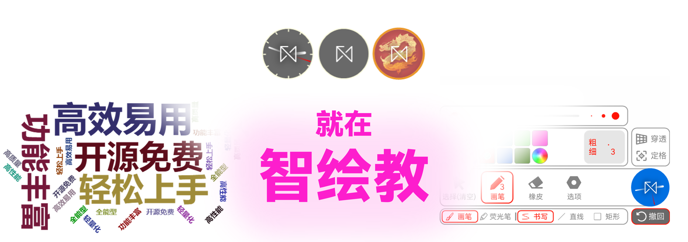

åŸå `Intelligent-Drawing-Teaching（简称 IDT）`，Windows å±å¹•æ‰¹æ³¨å·¥å…·ï¼Œæ‹¥æœ‰æ‰¹æ³¨é«˜æ•ˆå’ŒåŠŸèƒ½ä¸°å¯Œç­‰ç‰¹ç‚¹ï¼Œé€‚用äºè§¦æ‘¸è®¾å¤‡å’ŒPC端｜[智绘教Inkeys 官网](https://www.inkeys.top)

|  **GitHub 仓库** | [https://github.com/Alan-CRL/Inkeys](https://github.com/Alan-CRL/Inkeys) |
|:-:|:-:|
|  **GitHub å‘行版** | [https://github.com/Alan-CRL/Inkeys/releases](https://github.com/Alan-CRL/Inkeys/releases) |
| **Web 页é¢** | [./批注类/inkeys](https://nav.jursin.top/教辅软件/批注类/inkeys) |

<image src="icons/Inkways-Classic.png" height="32">

### Inkways-Classic

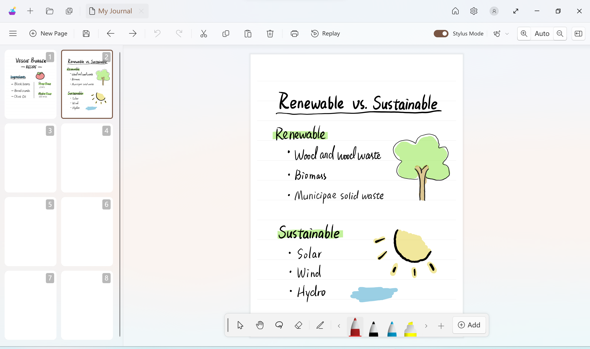

一个ç°ä»£åŒ–，简æ´è€Œå¼ºå¤§çš„，拥有智能书写算法优化的书写软件｜[官方网站](https://www.inkore.net/)

> [!important]
> 该软件为旧版本，已暂时下æ¶å¹¶åœæ­¢ç»´æŠ¤ï¼Œ**æš‚æ— å‘行版**。新版本正在**准备开å‘**中，敬请期待。

|  **GitHub 主页** | [https://github.com/Inkways](https://github.com/Inkways) |
|:-:|:-:|
| **Web 页é¢** | [./批注类/inkways-classic](https://nav.jursin.top/教辅软件/批注类/inkways-classic) |

### LemonxNote

一款用 C++ å’Œ Qt å¼€å‘çš„è½»é‡ç™½æ¿è½¯ä»¶ã€‚

|  **GitHub 仓库** | [https://github.com/lh11117/LemonxNote](https://github.com/lh11117/LemonxNote) |
|:-:|:-:|
|  **GitHub å‘行版** | [https://github.com/lh11117/LemonxNote/releases](https://github.com/lh11117/LemonxNote/releases) |
| **Web 页é¢** | [./批注类/lemonxnote](https://nav.jursin.top/教辅软件/批注类/lemonxnote) |

## 下载类

<image src="icons/SectionIstool.png" height="64">

### SectionIstool

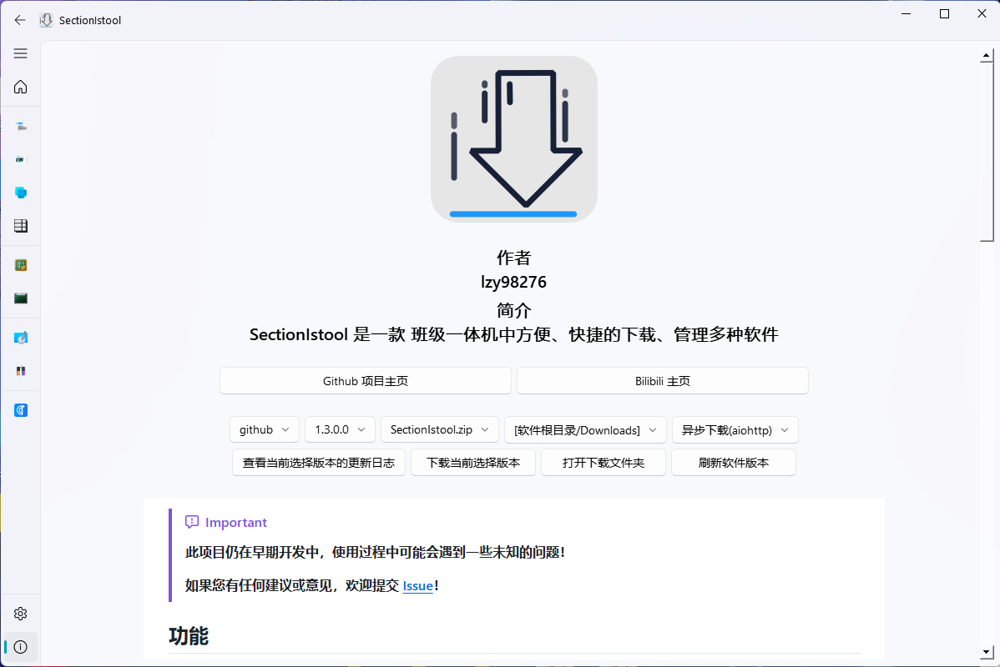

 

一款方便ã€å¿«æ·ä¸‹è½½é€‚åˆç­çº§ä¸€ä½“机使用的å„类软件的下载器

|  **GitHub 仓库** | [https://github.com/SectionIstool/SectionIstool](https://github.com/SectionIstool/SectionIstool) |
|:-:|:-:|
|  **GitHub å‘行版** | [https://github.com/SectionIstool/SectionIstool/releases](https://github.com/SectionIstool/SectionIstool/releases) |
| **Web 页é¢** | [./下载类/sectionistoo](https://nav.jursin.top/教辅软件/下载类/sectionistool)

> [!warning]
>
> **此项目ä»åœ¨æ—©æœŸå¼€å‘中，使用过程中å¯èƒ½ä¼šé‡åˆ°ä¸€äº›æœªçŸ¥çš„问题ï¼**

<image src="icons/SeewoHUB.png" height="64">

### SeewoHUB

 

一款方便ã€å¿«æ·ä¸‹è½½é€‚åˆç­çº§ä¸€ä½“机使用的å„类软件的下载器

 |  **GitHub 仓库** | [https://github.com/CNwenwen/SeewoHUB](https://github.com/CNwenwen/SeewoHUB) |
 |:-:|:-:|
 |  **GitHub å‘行版** | [https://github.com/CNwenwen/SeewoHUB/releases](https://github.com/CNwenwen/SeewoHUB/releases) |
 | **Web 页é¢** | [./下载类/seewohub](https://nav.jursin.top/教辅软件/下载类/seewohub)

> [!warning]
> **此项目ä»åœ¨æ—©æœŸå¼€å‘中，使用过程中å¯èƒ½ä¼šé‡åˆ°ä¸€äº›æœªçŸ¥çš„问题ï¼**

## éšæœºæŠ½é€‰

### NamePicker
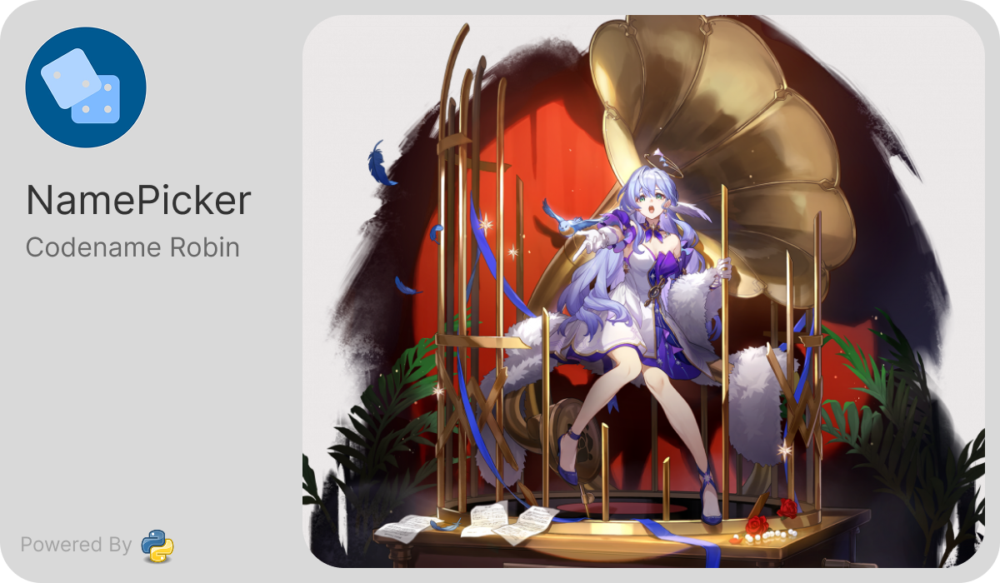
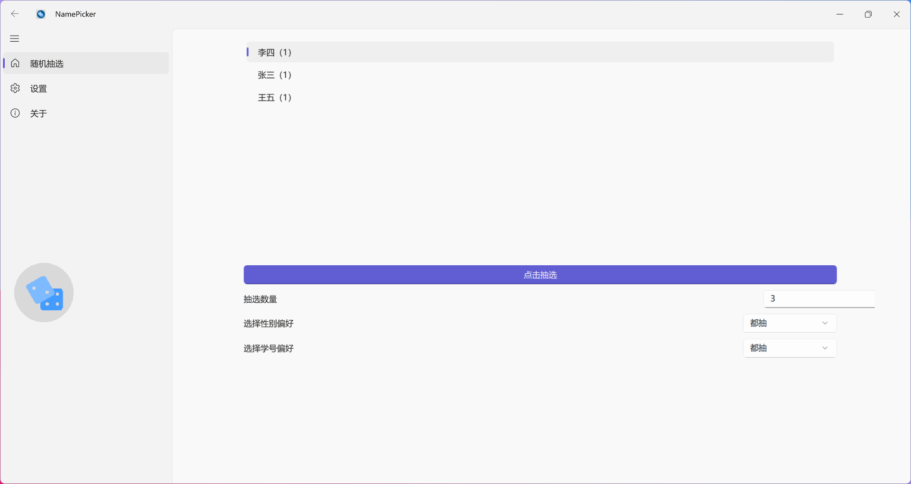

 

一款简æ´çš„点å软件｜[官方文档站](https://namepicker-docs.netlify.app)

|  **GitHub 仓库** | [https://github.com/NamePickerOrg/NamePicker](https://github.com/NamePickerOrg/NamePicker) |
|:-:|:-:|
|  **GitHub å‘行版** | [https://github.com/NamePickerOrg/NamePicker/releases](https://github.com/NamePickerOrg/NamePicker/releases) |
| **Web 页é¢** | [./éšæœºæŠ½é€‰/namepicker](https://nav.jursin.top/教辅软件/éšæœºæŠ½é€‰/namepicker)

### Rand
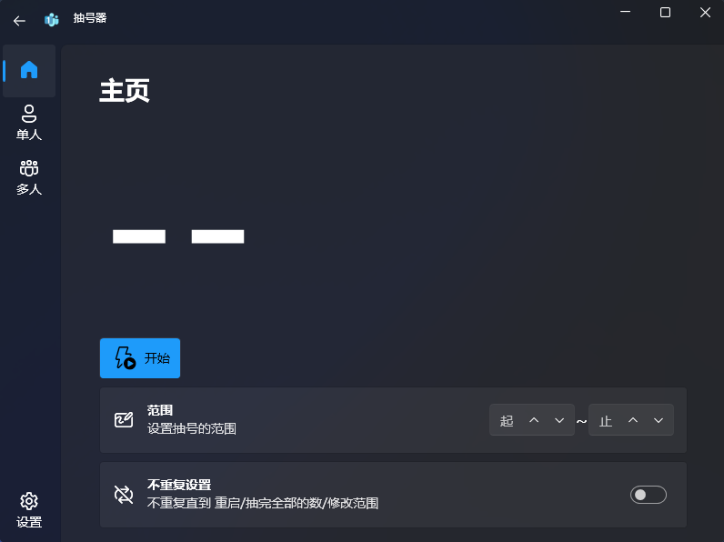

![C#](https://img.shields.io/badge/C%23-blue?logo=)

一款ç¾è§‚ã€æ˜“用ã€å¼ºå¤§çš„抽å·è½¯ä»¶

|  **GitHub 仓库** | [https://github.com/LuoYunXi0407/Rand](https://github.com/LuoYunXi0407/Rand) |
|:-:|:-:|
|  **GitHub å‘行版** | [https://github.com/LuoYunXi0407/Rand/releases](https://github.com/LuoYunXi0407/Rand/releases) |
| **Web 页é¢** | [./éšæœºæŠ½é€‰/rand](https://nav.jursin.top/教辅软件/éšæœºæŠ½é€‰/rand) |

###  SecRandom
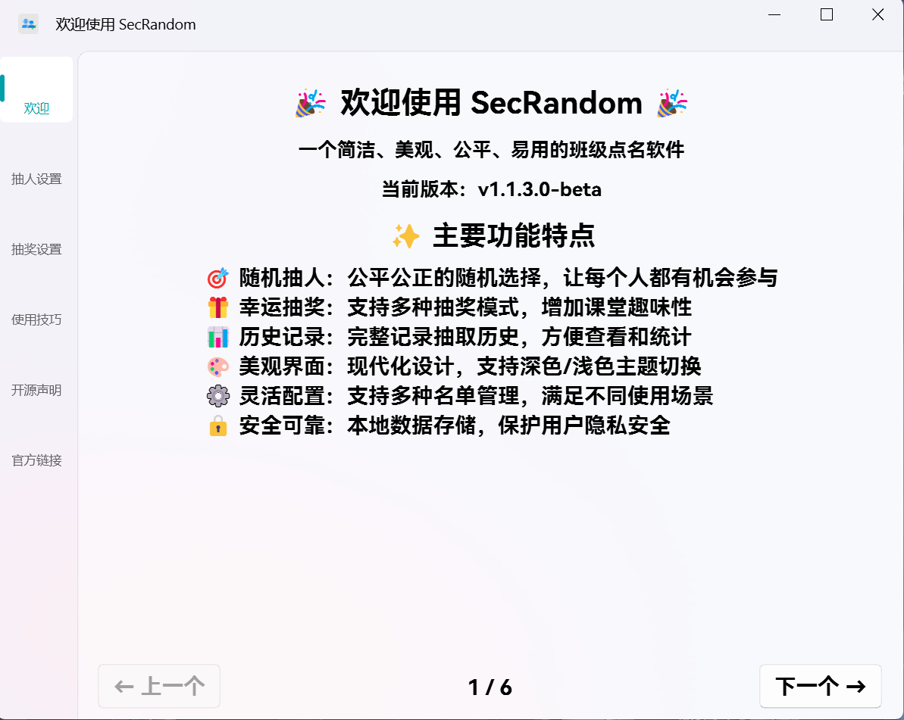

 

 

一款能以多ç§æ–¹å¼è¿›è¡Œå®Œå…¨å…¬å¹³çš„éšæœºæŠ½å–的软件｜[文档站](https://secrandom.netlify.app/)

|  **GitHub 仓库** | [https://github.com/SECTL/SecRandom](https://github.com/SECTL/SecRandom) |
|:-:|:-:|
|  **GitHub å‘行版** | [https://github.com/SECTL/SecRandom/releases](https://github.com/SECTL/SecRandom/releases) |
| **Web 页é¢** | [./éšæœºæŠ½é€‰/secrandom](https://nav.jursin.top/教辅软件/éšæœºæŠ½é€‰/secrandom) |

### ex-caller
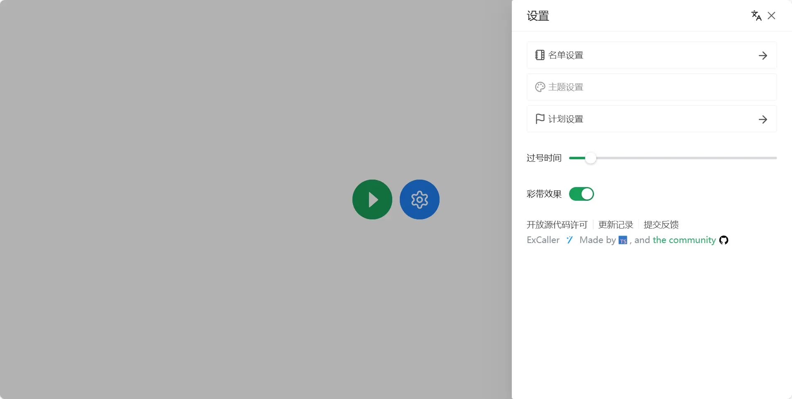

简约é£æ ¼çš„éšæœºç‚¹å工具

[网页版](https://ex-caller.by-ts.top)｜[离线版下载](https://ex-caller.by-ts.top/update)｜[最新å°é²œç‰ˆ](https://main.ex-caller.by-ts.top)

|  **GitHub 仓库** | [https://github.com/typed-sigterm/ex-caller](https://github.com/typed-sigterm/ex-caller) |
|:-:|:-:|
| **Web 页é¢** | [./éšæœºæŠ½é€‰/ex-caller](https://nav.jursin.top/教辅软件/éšæœºæŠ½é€‰/ex-caller) |

## 贡献者

<!-- readme: collaborators,contributors -start -->
<table>
	<tbody>
		<tr>
            <td align="center">
                <a href="https://github.com/Jursin">
                    
                     
                    <b>Jursin</b>
                </a>
            </td>
            <td align="center">
                <a href="https://github.com/MKStoler4096">
                    
                     
                    <b>MKStoler</b>
                </a>
            </td>
            <td align="center">
                <a href="https://github.com/Aris-Offline">
                    
                     
                    <b>Aris</b>
                </a>
            </td>
		</tr>
	<tbody>
</table>
<!-- readme: collaborators,contributors -end -->

## Star å†å²

如æœè¿™ä¸ªé¡¹ç›®å¯¹æ‚¨æœ‰å¸®åŠ©ï¼Œè¯·ç‚¹äº® Star â­ï½œ[å›åˆ°é¡¶éƒ¨ğŸ”¼](#awesome-class-softwares)

